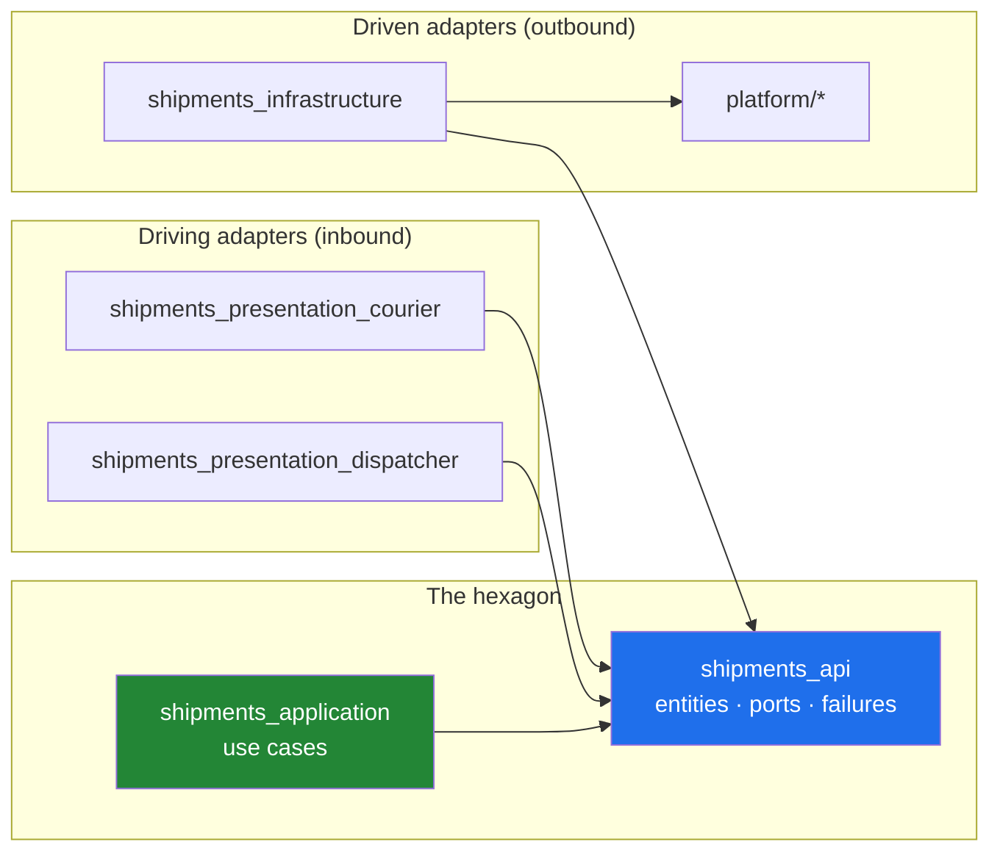

# flutter-hexagonal-monorepo

**A reference implementation of hexagonal architecture (ports and adapters) inside a large-scale Flutter monorepo.** The repository teaches one thing: what the architecture looks like when its rules are enforced at the *package* level rather than by convention — 74 packages, three applications, a dependency constitution checked by a tool, and a test suite built to scale.

**Peyk** is the sample product the architecture is demonstrated on: an enterprise courier and field-operations platform. A *peyk* was the Ottoman sultan's runner — the person who carried the message and the load. The domain is deliberately real enough to hurt: offline-first delivery, cash-on-delivery collection, route optimization, and an outbox that has to survive a dead network.

> Read the repository name to learn *what* is being shown. Read `Peyk` to know *where* to look for it.

---

## Why this repository exists

Most architecture examples fit in one package, so nothing stops a layer from reaching into another. The moment a codebase has 70 packages and 40 engineers, "we agreed not to import that" stops working. This repository takes the opposite position:

- **Every architectural rule is a package boundary.** A `_application` package physically cannot import an `_infrastructure` package, because it is not in its `pubspec.yaml`.
- **Every rule that can be machine-checked, is.** `tooling/arch_check` reads `rules.yaml` and fails the build on violation — deep imports, forbidden dependencies, cycles, `DateTime.now()` in domain code, missing barrels.
- **Every claim is backed by a runnable artifact.** The dependency graph is generated, not drawn. The contract test kits run against both the fake and the real adapter.

What this repository is **not**: a shippable product. Screens are skeletal, there is no backend, and some use cases exist as signature and flow only. The skeleton is the point.

---

## Architecture at a glance



Both the UI and the database are *adapters*. They point inward at the contract package; the contract package points at nobody. `_application` and `_infrastructure` never meet — only an app's composition root wires them together.

The generated, always-current graph lives in [`docs/dependency-graph.md`](docs/dependency-graph.md) (produced in Phase 8 by `tooling/dep_graph`).

---

## Package taxonomy

74 packages, each with exactly one job and one allowed dependency set.

| Package type | Count | Role | May depend on |
|---|---:|---|---|
| `core_kernel` | 1 | `Result`, `Failure`, `ValueObject`, `Entity`, `UseCase`, `DomainEvent`. Pure Dart, no third party, no codegen. | nothing |
| `core_ports` | 1 | Cross-cutting ports: `Clock`, `IdGenerator`, `Logger`, `DomainEventBus`, … | `core_kernel` |
| `core_navigation` | 1 | Route contracts shared by presentation packages | `core_kernel` |
| `core_testing` | 1 | `FakeClock`, `RecordingEventBus`, in-memory stores | `core_kernel`, `core_ports`, `core_navigation` |
| `<feature>_api` | 13 | Entities, value objects, sealed failures, **all ports**. Zero implementation. Pure Dart. | `core_kernel`, `core_ports`, other features' `_api` only |
| `<feature>_application` | 6 | Use cases. Pure Dart — this is what keeps the test suite fast. | own `_api`, `core_kernel`, `core_ports`, other features' `_api` |
| `<feature>_infrastructure` | 6 | Driven adapters, DTOs, mappers | own `_api`, `core_kernel`, `core_ports`, `platform/*` |
| `<feature>_core` | 7 | `application` + `infrastructure` fused, for light features | own `_api`, `core_kernel`, `core_ports`, `platform/*`, other `_api` |
| `<feature>_presentation*` | 14 | Driving adapters (UI, blocs) | own `_api`, other `_api`, `core_kernel`, `core_navigation`, `design_system` |
| `<feature>_testing` | 7 | Behavioural fakes + contract test kits | own `_api`, `core_kernel`, `core_ports`, `core_testing` |
| `platform/*` | 8 | Technology adapters: Dio, Drift, secure storage, location, media, connectivity, OTel, push | `core_kernel`, `core_ports` |
| `design_tokens` | 1 | Raw design values | nothing but `flutter` |
| `design_system` | 1 | Widgets and theming | `design_tokens`, `core_kernel` |
| `tooling/*` | 4 | `arch_check`, `test_runner`, `scaffold`, `dep_graph` | no product package |
| `apps/*` | 3 | Composition roots — the only place a service locator exists | everything |

The full, authoritative table is [`docs/DEPENDENCY_RULES.md`](docs/DEPENDENCY_RULES.md). `tooling/arch_check` enforces it.

### Why some features get five packages and others three

Heavy features (`identity`, `shipments`, `routing`, `delivery`, `payments`, `sync`) earn the full split. Light features (`vehicle_inventory`, `messaging`, `incidents`, `documents`, `notifications`, `reporting`, `settings`) start as `_api` + `_core` + `_presentation`. `_api` is *always* separate — it is the only thing that breaks cycles and narrows the blast radius of a change. A `_testing` package exists only when its fakes are consumed by another package. The calibration is written up in `docs/ARCHITECTURE.md`.

---

## The seven scenarios this repository was built to show

| # | Scenario | Where to look |
|---|---|---|
| 1 | Mutual need, no cycle — `payments` ↔ `shipments` via `_api` only | `payments_application`, `shipments_application` pubspecs |
| 2 | Loose coupling through domain events — `DeliveryCompleted` closes a collection | `delivery_application`, `payments_application`, `core_ports/DomainEventBus` |
| 3 | Inverted dependency — `sync` carries every feature's writes and knows none of them | `sync_api/SyncCommand`, app composition roots |
| 4 | Two adapters, one port — `LocalHeuristicOptimizer` vs `RemoteSolverOptimizer` | `routing_infrastructure`, `routing_testing` contract kit |
| 5 | Three composition roots, three adapter sets, one core | `apps/app_courier`, `apps/app_dispatcher`, `apps/app_harness` |
| 6 | Permission checks across a contract — dispatcher UI asks `identity_api` | `shipments_presentation_dispatcher` |
| 7 | One feature, two UIs — proof that driving adapters are swappable | `shipments_presentation_courier` + `_dispatcher` |

---

## Repository layout

```
.
├── pubspec.yaml              # pub workspace root + melos configuration
├── analysis_options.yaml     # very_good_analysis + generated-file relaxations
├── dart_test.yaml            # tags: unit/widget/golden/integration, preset: pr
├── lefthook.yml              # pre-commit format+analyze, pre-push gen:check+arch_check
├── CLAUDE.md                 # the architectural constitution, in enforceable form
├── docs/
│   ├── ARCHITECTURE.md
│   ├── DEPENDENCY_RULES.md
│   ├── TESTING.md
│   ├── CI_CD.md
│   └── dependency-graph.md   # generated by tooling/dep_graph
├── apps/                     # app_courier · app_dispatcher · app_harness
├── packages/
│   ├── core/                 # core_kernel · core_ports · core_navigation · core_testing
│   ├── features/             # 13 features
│   ├── platform/             # 8 technology adapters
│   └── design/               # design_tokens · design_system
└── tooling/                  # arch_check · test_runner · scaffold · dep_graph
```

---

## Quick start

Requires **Flutter 3.44.2 / Dart 3.12.2** — pinned in `.fvmrc` and `.tool-versions`.

```bash
# 1. Resolve the whole workspace in one shot (pub workspaces: one lockfile, one .dart_tool)
dart pub get

# 2. Melos is a dev_dependency, so no global install is required
dart run melos --help

#    Optional, for a shorter command line:
dart pub global activate melos 8.3.0

# 3. Everyday commands
dart run melos run format          # format check across the workspace
dart run melos run analyze         # dart analyze --fatal-infos everywhere
dart run melos run gen             # codegen for changed packages + their dependents
dart run melos run gen:check       # fail if any generated file is stale (what CI runs)
dart run melos run arch:check      # enforce the dependency constitution
dart run melos run test:affected   # run only the tests a change can break
```

If your editor reports `depend_on_referenced_packages` on imports that `dart run melos run analyze` accepts, the Dart analysis server is holding analysis contexts from before those packages existed. Restart it — **Dart: Restart Analysis Server** in the VS Code command palette. The command line is the source of truth.

Git hooks are managed by [lefthook](https://github.com/evilmartians/lefthook):

```bash
brew install lefthook   # or: npm i -g lefthook
lefthook install
```

---

## Phase tags

The commit history is part of the lesson. Every phase is a tag, so you can check out any stage of the build-up and see the architecture with exactly that much of it in place.

| Tag | Contents |
|---|---|
| `phase-00` | Repository foundation: workspace root, melos scripts, lint and test configuration, dependency rules, `CLAUDE.md` |
| `phase-01` | Core packages — `core_kernel`, `core_ports`, `core_navigation`, `core_testing` |
| `phase-02` | Eight platform adapters, including Drift schema and migration tests |
| `phase-03` | `arch_check` and `scaffold` — the rules become machine-enforced from here on |
| `phase-04` | Reference features `identity` and `shipments`, including the status machine and the first contract kit |
| `phase-05` | Cross-cutting features `routing`, `delivery`, `payments`, `sync` — all seven scenarios visible in code |
| `phase-06` | Seven light features on the reduced three-package split |
| `phase-07` | `design_tokens`, `design_system`, and the three composition roots |
| `phase-08` | `test_runner`, `dep_graph`, CI/CD pipelines, and the full documentation set |

```bash
git checkout phase-04   # the architecture as of the reference features
```

---

## Documentation

| Document | What it answers |
|---|---|
| [`CLAUDE.md`](CLAUDE.md) | The constitution: package types, forbidden moves, codegen rules, commit discipline |
| [`docs/DEPENDENCY_RULES.md`](docs/DEPENDENCY_RULES.md) | Which package may depend on which, in the form `arch_check` enforces |
| [`docs/ARCHITECTURE.md`](docs/ARCHITECTURE.md) | Hexagonal mapped onto this repository, the seven scenarios, a request traced end to end |
| [`docs/TESTING.md`](docs/TESTING.md) | The pyramid, contract kits, hermeticity rules, and how this shape reaches 100k tests |
| [`docs/CI_CD.md`](docs/CI_CD.md) | PR / main / nightly / release pipelines and the caching strategy |
| [`docs/HEXAGONAL_MONOREPO_PROJECT_SPEC.md`](docs/HEXAGONAL_MONOREPO_PROJECT_SPEC.md) | The original specification this repository is built from |

Documents marked above are written in the phase that produces them; before that phase they may be absent.

---

## License

[MIT](LICENSE) © 2026 Yunus Emre Alpak
