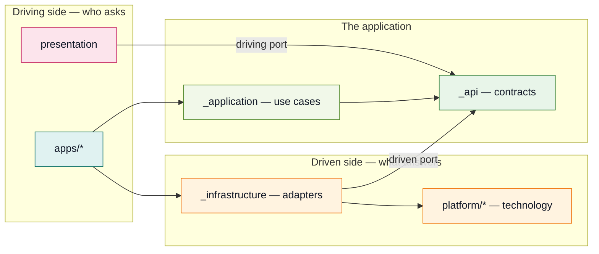
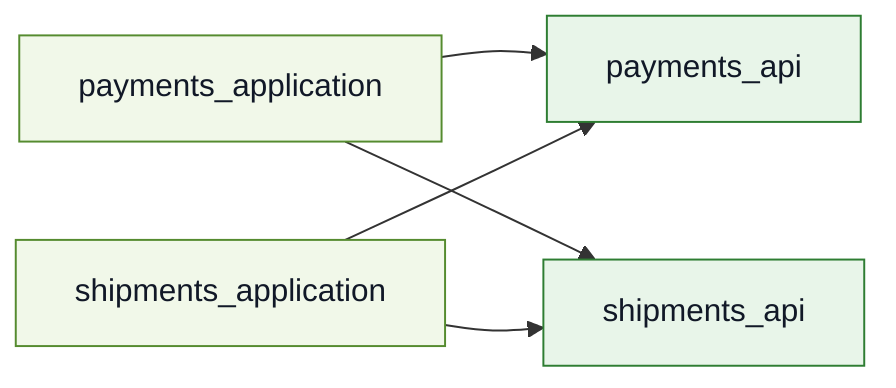
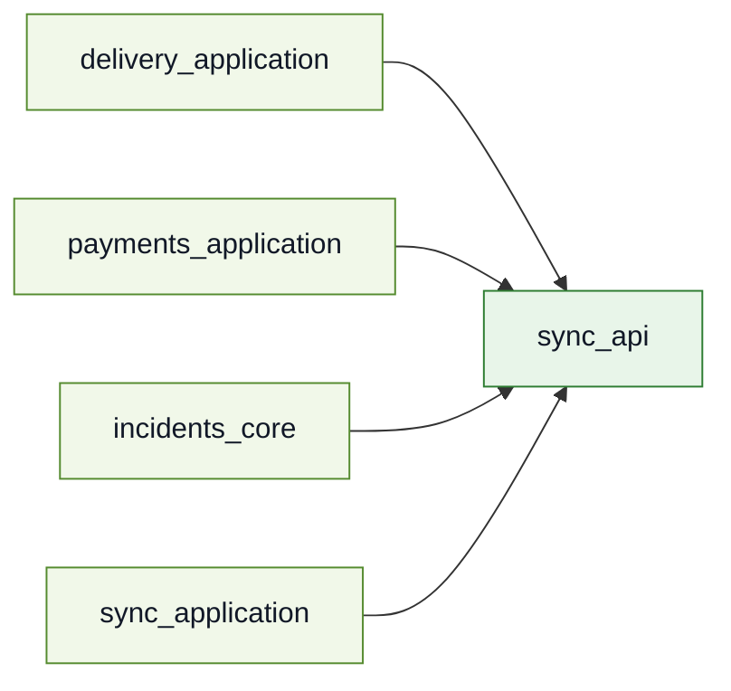
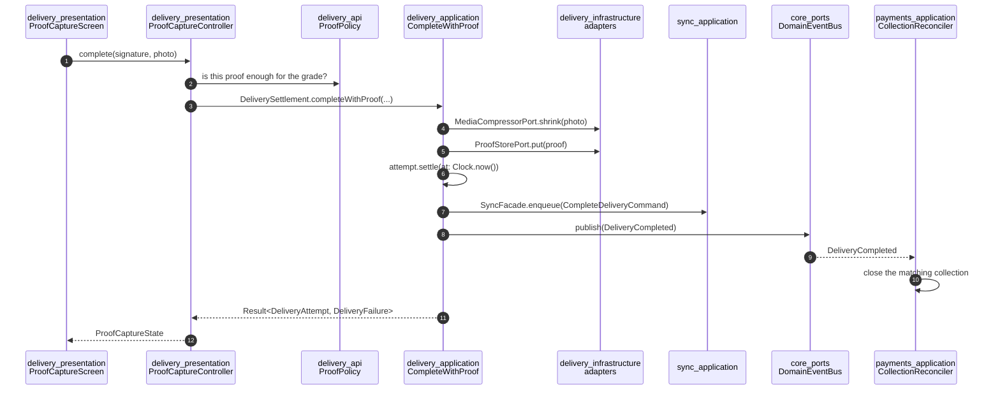

# Architecture

This is the explanation half of the repository. [`CLAUDE.md`](../CLAUDE.md) is the constitution and [`DEPENDENCY_RULES.md`](DEPENDENCY_RULES.md) is what the checker enforces; this document is the *why*, and it is written to be read top to bottom once and then dipped into.

The product is **Peyk**, an enterprise courier and field-operations platform. It is a skeleton: it compiles, its tests pass, and every architectural rule is physically visible. It is not a shippable app, and section 9 says plainly which claims it does not make.

---

## 1. Hexagonal architecture, as it lands here

Cockburn's pattern says: an application is a hexagon; everything outside it reaches in through a **port**; an **adapter** is what makes a particular technology fit a port. The pattern does not say how to lay that out in a repository. This one answers with packages, because a package is the only boundary a compiler enforces — a folder is a suggestion, and a suggestion is what a deadline overrules.

Four things to read off that picture, because each of them is a rule somewhere:

**Both kinds of port are declared in `_api`.** A driving port is what a screen calls (`RoutePlanning`); a driven port is what a use case needs answered (`RouteCache`). They live in the same package because both are the feature's vocabulary, and the arrows around them point in opposite directions: presentation depends *down* onto the contract, infrastructure depends *up* onto it. That opposition is dependency inversion, and it is why `_application` and `_infrastructure` never name each other.

**The arrows into `_api` never come back out.** A contract package depends on `core_kernel`, `core_ports` and other features' contracts, and on no implementation anywhere. That single fact is what keeps the graph acyclic with 75 packages in it (§5.1).

**An app is the only place the halves meet.** Nothing else may depend on both `_application` and `_infrastructure`. This is why three apps can hold three different sets of adapters over one set of use cases (§5.5).

**`platform/*` is not the same thing as `_infrastructure`.** A platform package speaks a technology's words — `HttpTransport`, `LocationSource` — and a feature's infrastructure speaks the product's, using a technology to answer it. Nothing in the product asks for "an HTTP request"; `shipments` asks for a manifest. §2.2 of the dependency rules is the test for which is which.

---

## 2. The package types, and why each one exists

| Type | Count | May depend on | Exists so that |
|---|---|---|---|
| `core_kernel` | 1 | nothing | `Result`, `Failure`, `ValueObject` have one definition. Nothing generated, so regenerating it never costs the workspace. |
| `core_ports` | 1 | `core_kernel` | capabilities more than one feature needs and none owns — `Clock`, `Logger`, `SecureStore`, `DomainEventBus`. |
| `core_navigation` | 1 | `core_kernel` | route contracts a presentation package declares and an app assembles. |
| `core_testing` | 1 | the three above | the behavioural fakes for `core_ports`. A fake belongs with the contract it imitates. |
| `<feature>_api` | 13 | `core_kernel`, `core_ports`, other `_api` | the feature's whole vocabulary: entities, value objects, both kinds of port, sealed failures. It is the only package other features compile against. |
| `<feature>_application` | 6 | own `_api`, other `_api` | use cases. Pure Dart, blind to every adapter. |
| `<feature>_infrastructure` | 6 | own `_api`, `platform/*` | outbound adapters, DTOs, mappers. Never sees another feature. |
| `<feature>_core` | 7 | own `_api`, `platform/*` | application and infrastructure together, for a feature narrow enough that the split would cost more than it explains. |
| `<feature>_presentation*` | 14 | own `_api`, other `_api`, `core_navigation`, `design_system` | the UI. A feature may have more than one, per audience (§5.7). |
| `<feature>_testing` | 7 | own `_api`, `core_testing` | fakes and contract kits that *other packages' tests* consume. Created only when that is true. |
| `platform/*` | 9 | `core_kernel`, `core_ports`, Flutter | one technology contract, its adapter and its fake. Two platform packages never depend on each other. |
| `design_tokens` | 1 | Flutter | colour, spacing, type, motion. The narrowest package after `core_kernel`. |
| `design_system` | 1 | `design_tokens`, `core_kernel` | the components, and `StringCatalogue` — a driven port declared where presentation can see it and answered where an app can. |
| `tooling/*` | 4 | no workspace package at all | the checkers. A tool that was part of the workspace it checks could not run against a workspace that is broken, which is the only time it matters. |
| `apps/*` | 3 | anything | composition roots. |

The live version of that table, with every edge as it actually exists, is [`dependency-graph.md`](dependency-graph.md) — generated, committed, and regenerated by `melos run graph`.

### When a feature deserves a full split

The reduced split is `_api`, `_core`, `_presentation`. The full split adds `_application` and `_infrastructure` as separate packages. `_api` is separate in **every** case, because it is the only thing that resolves cycles and narrows blast radius; that is not a judgement call.

A feature earns the full split when **at least one** of these is true:

1. **It has more than one outbound adapter for the same port.** `routing` has two `RouteOptimizerPort` implementations and they are the entire argument of §5.4. Two adapters in one `_core` package is two technologies in a package that also holds the rules.
2. **It has real business rules that must be testable without a device.** `delivery` has `ProofPolicy`; `shipments` has a state machine. A pure-Dart `_application` package runs its suite in milliseconds, and `flutter test` on a package that has no Flutter in it is several seconds of start-up per run, every run, forever.
3. **It behaves differently offline.** `sync`, `delivery` and `shipments` queue, cache and reconcile. The queueing is infrastructure and the decision to queue is a use case, and mixing them is how a retry policy ends up inside a rule.

The six that took it — `identity`, `shipments`, `routing`, `delivery`, `payments`, `sync` — each satisfy two or three. The six that did not — `settings`, `notifications`, `incidents`, `messaging`, `reporting`, `documents`, `vehicle_inventory` — have one adapter, thin rules, and no offline story. **A reduced-split feature that grows a second adapter is a feature to split**, and because `_api` was already separate, splitting it changes no other package's pubspec.

A `_testing` package is created when, and only when, another package's tests consume its fakes. Seven features have one; the other six would have shipped an empty package to be consistent with a rule nobody wrote.

---

## 3. The seven scenarios

These are the specification's own tests of the architecture. Each one is visible in the code, and each is here with the decision it forced.

### 5.1 Two features that need each other, and no cycle

`payments` needs a `ShipmentId` and a summary to attach a collection to a parcel. `shipments` needs to show whether a parcel has been paid for. The obvious move is a `shared` package, and it is forbidden (rule 4 of §2 in the constitution).

What happens instead: **`payments_application` depends on `shipments_api`; `shipments_application` depends on `payments_api`.** Neither `_application` package appears in the other's pubspec. A contract package depends on no implementation, so the two arrows cannot close a loop.

The general form is worth stating because it is the answer every time: **a mutual need between two features is answered with mutual contract dependencies, never with a third package.** A `shared` package makes the graph green and the architecture worse — it collects whatever two features happened to have in common, which is a set with no owner and no reason to be stable.

`dep_graph` renders exactly this subgraph, and the type-level diagram shows it as a self-edge on `feature_api`.

### 5.2 Loose coupling through an event

When a delivery completes, the matching cash collection has to close. `delivery_application` publishes `DeliveryCompleted`; `payments_application`'s `CollectionReconciler` subscribes. **Neither package names the other**; both name `DomainEventBus` in `core_ports`, and the event type itself is declared in `delivery_api` — which `payments` may see, because a contract may cross and an implementation may not.

The ordering inside `CompleteWithProof` is the part that is easy to get wrong: the event is published **after** the write is queued, not before. A subscriber reacting to a delivery that was never durably recorded is reacting to something that did not happen.

### 5.3 An inverted dependency: sync carries every write and knows no feature

`sync` transports every feature's writes. The intuitive dependency — sync knows about deliveries and payments — is exactly backwards.

**Features depend on `sync_api`. `sync` depends on no feature.** A feature expresses its write as a `SyncCommand`: a routing key and a serialised payload. `CompleteDeliveryCommand` lives in `delivery_application` — not in `_api`, because a serialised payload is a wire concern; not in `_infrastructure`, because it is a value a use case has to be able to build.

#### The registry an app owns, and why it cannot live in sync

`sync_application` sees generic envelopes. Something still has to map a command *type* to the transport handler that knows the endpoint, the retry class and the conflict policy for it — and that something is a **registry built in the composition root**. It is the app, and only the app, that is allowed to know both "this string means a completed delivery" and "that endpoint takes one".

Put the registry inside `sync_application` and the arrow reverses: sync would import `delivery_application` to name its command, and the feature that was supposed to be ignorant of every feature would depend on all of them. Put it in a feature and every feature owns a piece of the transport. The app is the only place with no one downstream of it, which is why every "who knows about everything" job in this workspace ends up there.

### 5.4 One port, two adapters, one contract kit

`RouteOptimizerPort` has three implementations: `LocalHeuristicOptimizer` (nearest-neighbour, on the phone), `RemoteSolverOptimizer` (a solver, over HTTP), `FakeRouteOptimizer` (in `routing_testing`). All three are held to `runRouteOptimizerContract`, the same suite, in `routing_testing`.

The design decision that makes that contract writable is a split inside the port: **an optimiser returns a permutation and nothing else.** The estimates are computed by `RoutePlan` from the order plus the traffic profile plus the service times. Comparing orderings is exact; comparing instants would have two implementations drifting apart on the first rounding difference, and would let a solver written by another team disagree about how this operation computes an arrival time.

`routing_application` does not change a line between the two. `app_courier` binds the heuristic because a courier in a tunnel still has to be given an order to drive; `app_dispatcher` binds the solver because an operator planning forty routes has a connection and needs answers a phone cannot compute.

### 5.5 Three composition roots over one set of use cases

| Port | `app_courier` | `app_dispatcher` | `app_harness` |
|---|---|---|---|
| `RouteOptimizerPort` | `LocalHeuristicOptimizer` | `RemoteSolverOptimizer` | `FakeRouteOptimizer` |
| `CredentialGateway` | `DeviceBoundCredentialGateway` | `SsoCredentialGateway` | `FakeCredentialGateway` |
| `OutboxStore` | `DriftOutboxStore` | `InMemoryOutboxStore` | `InMemoryOutboxStore` |
| `ProofStorePort` | `LocalEncryptedProofStore` | `RemoteProofStore` | `FakeProofStore` |
| `PaymentsGateway` | `RestPaymentsGateway` | `RestPaymentsGateway` | `FakePaymentsGateway` |

Three rows are worth reading twice. `PaymentsGateway` is the **same** in both product apps, because money goes to one place however it was taken — a table where every row differed would be a table describing a rule rather than decisions. `InMemoryOutboxStore` in `app_dispatcher` is a *choice*, not an absence: that app binds a database two registrations away, and its queue is in memory because a desk is online and a queue that outlived a session is a queue nobody drains. `LocalEncryptedProofStore` versus `RemoteProofStore` is the offline story: a signature taken in a basement has to be kept until the queue drains, and a desk keeping a copy of somebody's signature would be a second place it exists and a second place it leaks.

#### An adapter may live in an app, when it answers a capability the device lacks

A desk has no push client, and `push_messaging` is not a dependency of `app_dispatcher`. `NotificationsCoordinator` still takes an `AlertChannel`, so the app answers with `DeskAlertChannel`, which returns `AlertsRefused` — a case the sealed failure type already has, which `notifications_presentation` already renders, and for which the inbox already draws no retry button. A stub returning `Success` would have told a dispatcher their alerts were on and then delivered nothing.

It lives in `apps/app_dispatcher/lib/src/di/` because it is not a way of delivering alerts. It is that app's answer to a capability the device does not have, and `notifications` has no business knowing that some apps are desks.

#### How wide a driving port is — the correction this scenario forced

Scenario 5 was written as "three apps, three adapter sets". Phase 8 found the sentence was hiding something: **an app was being forced to supply adapters for operations its audience can never perform.**

`RoutingFacade` and `DeliveryFacade` each declared every operation of their feature, and one coordinator implemented each. So `app_dispatcher` — which wants `resequence`, a desk's override of a driving order — also had to bind `RecalculateOnDeviation`, and the `LocationStreamPort` behind it, over **the desk's own GPS**. Same for delivery: reading an attempt back meant binding `StartAttempt` and the geofence that asks whether *this device* is at a consignee's door.

That is the Interface Segregation Principle at class level and the **Common Reuse Principle** at package level — do not force a component's users to depend on things they do not need — and here the harm was transitive and visible in a `pubspec.yaml` as `location_service`.

The correction, now [§2.3 of the dependency rules](DEPENDENCY_RULES.md):

| routing | operations | composed by |
|---|---|---|
| `RoutePlanning` | `planRoute`, `currentPlan`, `changes` | both |
| `RouteSupervision` | `resequence` | the desk |
| `RouteFollowing` | `nextStop`, `recalculateOnDeviation` | the vehicle |

| delivery | operations | composed by |
|---|---|---|
| `DeliveryExecution` | `startAttempt` | the courier |
| `DeliverySettlement` | `completeWithProof`, `failWithReason` | both |
| `DeliveryHistory` | `attemptsFor`, `changes` | both |

Three things came out of it that a reader should take rather than rediscover:

**The line is drawn where a driven port stops being answerable**, not where the methods group tidily. `startAttempt` needs a geofence; settling an attempt needs a store and a queue. One of those a desk can answer honestly and the other it cannot.

**Absence of capability and absence of intent want opposite answers.** `DeskAlertChannel` is the first: the domain still asks, and "cannot" is a real answer, so a driven adapter declines. A driving operation an audience never performs is the second: nobody asks, so a documented refusal would be unreachable code standing in for a compile-time fact — it is absent from the interface that audience holds.

**Segregating an interface is not segregating a composition.** `IdentityCoordinator` implements `IdentityFacade`, `SessionReader` and `PermissionChecker` from one constructor, and that limits what a caller may *ask* without limiting what an app must *supply*. Routing and delivery needed both halves split, which is why each has one coordinator per port and a shared `RouteChannel` / `DeliveryChannel` for the change stream — one fact that three interfaces report.

The whole investigation, including what the literature said and what was ruled out, is in [`research/facade-port-coupling.md`](research/facade-port-coupling.md).

### 5.6 A permission asked through a contract

`shipments_presentation_dispatcher` asks `PermissionChecker` — declared in `identity_api` — whether the signed-in actor holds `Permission.assignShipment` before it renders bulk assignment. It never learns how identity decided: not from a role, not from a grant, not from anything but the answer.

`delivery_presentation` asks the same port about `Permission.completeDelivery`, and reads it on every build rather than caching it. A permission can be revoked mid-shift, and a screen that answered from a value it captured when it opened would keep offering an action the operation has taken away.

### 5.7 One feature, two UIs

`shipments` has `shipments_presentation_courier` and `shipments_presentation_dispatcher`. This is the driving adapter's substitutability made concrete: two screens over one `ShipmentsFacade`, sharing no widget and no controller.

They disagree about the *same* state, which is the interesting part. `undeliverable` is a danger on a dispatcher's board — somebody has to act — and a warning on a courier's list, where it is a fact about a parcel they are done with. Neither is a translation of the other, and `shipments_application` changed for neither.

Routing shows the other half of the same idea: **one** presentation package, two destinations. `routing.myRoute` is mounted in the courier app and `routing.courierRoute` in the dispatcher's, over the same `RouteScreen` — with different controllers, per §2.3.

---

## 4. Following one request through the packages

A courier taps **Done** on a delivery with a signature and a photograph. Here is every package it touches, in order.

Step by step, with the rule each step is obeying:

1. **`ProofCaptureScreen` → `ProofCaptureController`** (`delivery_presentation`). The controller holds four ports and no implementations. It has no `Clock`, and cannot have one: §2 does not give a presentation package `core_ports`, so the proof takes its instant from the evidence through `ProofOfDelivery.from`.
2. **The controller asks `ProofPolicy`** (`delivery_api`). How much evidence a hand-over needs depends on what the parcel is worth. The rule is on the entity rather than in the use case, so it holds for the courier's screen, the desk's correction and the sync drain replaying a queued attempt alike. A copy in the screen would tell a courier they were finished on the day the policy changed.
3. **`DeliverySettlement.completeWithProof`** — a driving port in `delivery_api`, implemented by `DeliverySettlementCoordinator` in `delivery_application`. The controller cannot see that class and does not know it exists.
4. **`MediaCompressorPort.shrink`**, then **`ProofStorePort.put`** — driven ports in `delivery_api`, answered in `delivery_infrastructure` by adapters that use `platform/media_capture` and `platform/storage_drift`. The order matters: compress against the limit the app supplied *before* paying for a store.
5. **`attempt.settle(at: Clock.now())`** — the entity moves itself, and the instant comes from the `Clock` port in `core_ports`. Rule 1.2.8: a test that uses the real clock is a test that will flake.
6. **`SyncFacade.enqueue`** — scenario 5.3. The write goes into a queue; the courier is not made to wait for a server. The payload carries the proof's *handle*, never its bytes: an outbox row is a TEXT column on a device that may be holding a day's work.
7. **`DomainEventBus.publish(DeliveryCompleted)`** — scenario 5.2, after the queue accepted the write.
8. **`payments_application` closes the collection** without either package naming the other.
9. **A `Result` comes back**, never an exception (rule 1.2.9). The failure type is `sealed`, so `ProofCaptureScreen`'s mapping from failure to string key is checked by the compiler for exhaustiveness.
10. **The app supplies the words.** `describe` returns a *key*; `StringCatalogue` in the app answers it. `InvalidCredentials` and `DeviceNotRegistered` map to one key on purpose, so two apps cannot accidentally give them different wording and leak whether an account exists.

Nine packages, four of which cannot see each other, and every boundary crossed through a contract.

---

## 5. Code generation, and why the output is committed

`freezed` runs in `_api`; `json_serializable` in `_infrastructure` and `platform/*`; `drift_dev` where things persist; `injectable_generator` in apps only; `go_router_builder` in presentation; `flutter gen-l10n` in apps and `design_system`. Each package's `build.yaml` enables only what it needs — by default build_runner offers every builder to every package, which across 75 of them is significant waste.

**No code generation in `core_kernel`.** It is the innermost ring, so regeneration cost there spreads across everything. `Result`, `Failure` and `ValueObject` are hand-written.

Generated files are committed, and the reasons are in increasing order of importance:

1. **CI time.** Without them every run starts by generating the whole workspace.
2. **Reviewability.** The diff a source change produces is visible in the pull request — a case added to a `freezed` union shows where it landed.
3. **Correctness of affected-test selection.** Test selection derives from `git diff`. If generated files are not in the repository, the files produced later in the workspace are invisible to the diff and the affected-package set comes out wrong. This is the one that would bite silently: a wrong test selection reports green.

The cost is diff noise, mitigated by `linguist-generated=true` in `.gitattributes`, and staleness, which `melos run gen:check` fails on.

### The shipments state machine: a generated union, hand-written rules

`ShipmentStatus` is a `freezed` sealed union of seven states. `StatusTransition` is a generated record of one move. Both are generated because they are *data*: they have no identity of their own, nothing to validate, and nothing secret in them.

What is **not** generated is which moves are legal. `Shipment._moveTo` switches on the `(from, to)` pair by hand and returns `Result<Shipment, ShipmentFailure>`; `assignTo`, `loadOnto`, `startDelivery`, `completeDelivery`, `failDelivery` and `returnToDepot` are hand-written methods over it.

That division is rule 4.2.3 — `freezed` does not replace domain validation — and the reason is what a generator can and cannot know. `freezed` can produce a union and a `copyWith`; it cannot know that a parcel may not go from `awaitingAssignment` straight to `deliveredToConsignee`. Push the rule into an annotation and you get a second, worse language for expressing it, checked by nothing. Leave it in a `switch` over a sealed type and the compiler tells you the day somebody adds an eighth state and forgets a case.

---

## 6. Where the rules are actually enforced

A rule nobody checks is a comment.

| Rule | Enforced by | When |
|---|---|---|
| §2 allowed dependencies | `arch_check` | pre-commit, pre-push, CI |
| §3 structure: barrels, naming, registration, deep imports | `arch_check` | same |
| §4 forbidden imports, §5 forbidden APIs (AST, not text) | `arch_check` | same |
| No cycles | `arch_check`, and independently `dep_graph` | same |
| Generated files current | `melos run gen:check` | pre-push, CI |
| Dependency graph current | `melos run graph:check` | pre-push, CI |
| Affected tests pass | `test_runner --affected` | pre-push, CI |
| Full suite, every tag, full regeneration | nightly | 02:30 UTC |

Three rules resist a checker and stay a review responsibility — cycle *resolution*, DTO/entity separation, and now §2.3's driving-port width. §8 of the dependency rules lists them so that nobody mistakes "arch_check is green" for "the architecture is intact".

---

## 7. Reading order

- [`DEPENDENCY_RULES.md`](DEPENDENCY_RULES.md) — what the checker enforces, section by section.
- [`dependency-graph.md`](dependency-graph.md) — the graph as it is, generated.
- [`TESTING.md`](TESTING.md) — the pyramid, contract kits, hermeticity, and how this shape reaches 100,000 tests.
- [`CI_CD.md`](CI_CD.md) — which gate lives in which job, and why.
- [`research/facade-port-coupling.md`](research/facade-port-coupling.md) — one architectural question, researched and settled, kept as a worked example.

---

## 8. What this repository does not claim

It has no backend, no finished visuals, no complete business logic, and no iOS or Android projects — the specification excludes all four. `codemagic.yaml` and `fastlane/Fastfile` are real and consistent, and they say at the top what has to exist before they can run.

The claim it does make is narrower and harder: that every rule above is visible in the code, checked by something, and explained where it was decided.
