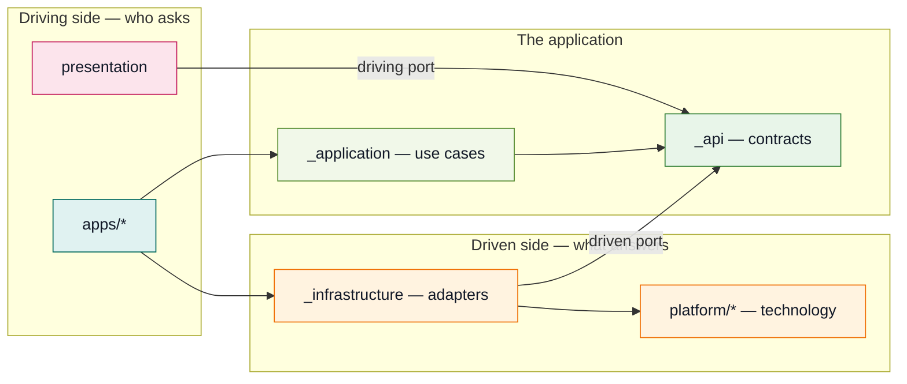
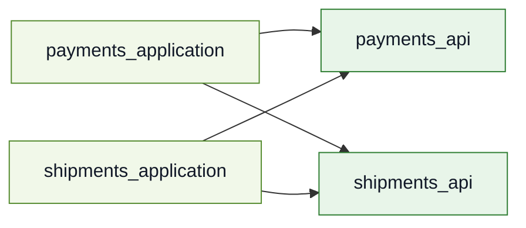
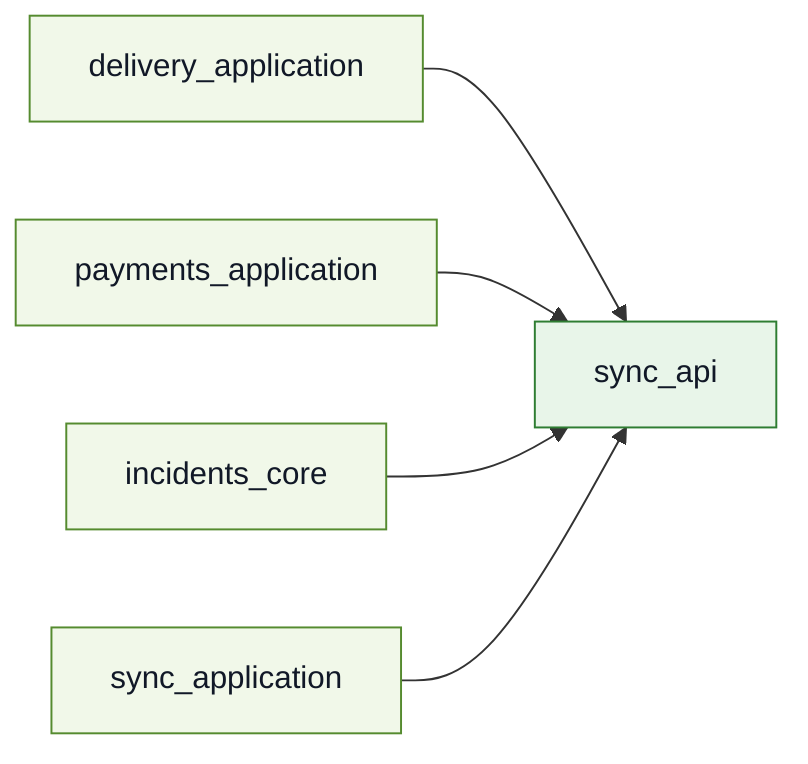
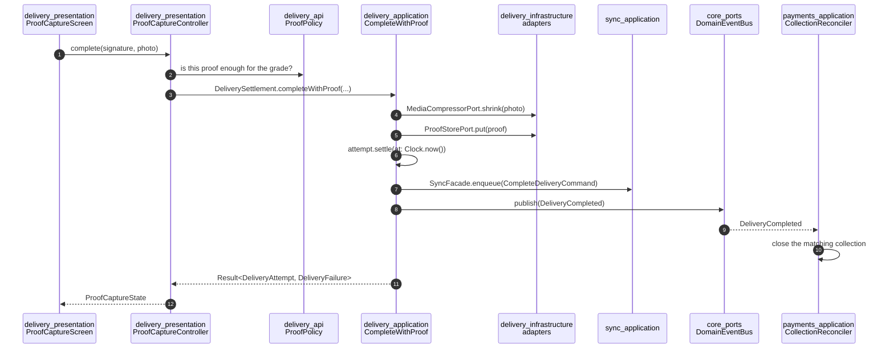
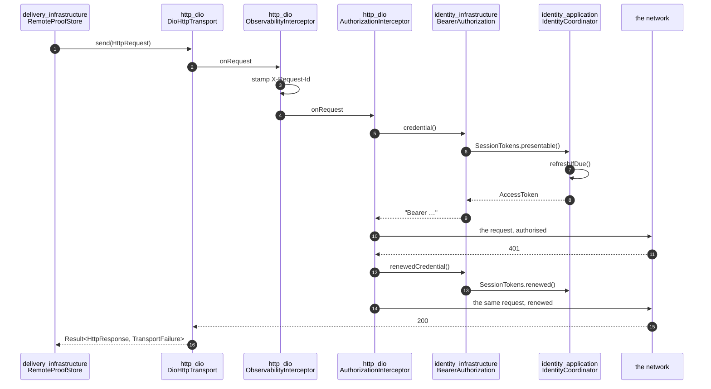

# Architecture

This is the explanation half of the repository. [`CLAUDE.md`](../CLAUDE.md) is the constitution and [`DEPENDENCY_RULES.md`](DEPENDENCY_RULES.md) is what the checker enforces; this document is the *why*, and it is written to be read top to bottom once and then dipped into.

The product is **Peyk**, an enterprise courier and field-operations platform. It is a skeleton: it compiles, its tests pass, and every architectural rule is physically visible. It is not a shippable app, and section 9 says plainly which claims it does not make.

---

## 1. Hexagonal architecture, as it lands here

Cockburn's pattern says: an application is a hexagon; everything outside it reaches in through a **port**; an **adapter** is what makes a particular technology fit a port. The pattern does not say how to lay that out in a repository. This one answers with packages, because a package is the only boundary a compiler enforces — a folder is a suggestion, and a suggestion is what a deadline overrules.



Four things to read off that picture, because each of them is a rule somewhere:

**Both kinds of port are declared in `_api`.** A driving port is what a screen calls (`RoutePlanning`); a driven port is what a use case needs answered (`RouteCache`). They live in the same package because both are the feature's vocabulary, and the arrows around them point in opposite directions: presentation depends *down* onto the contract, infrastructure depends *up* onto it. That opposition is dependency inversion, and it is why `_application` and `_infrastructure` never name each other.

**The arrows into `_api` never come back out.** A contract package depends on `core_kernel`, `core_ports` and other features' contracts, and on no implementation anywhere. That single fact is what keeps the graph acyclic with 75 packages in it (§5.1).

**An app is the only place the halves meet.** Nothing else may depend on both `_application` and `_infrastructure`. This is why three apps can hold three different sets of adapters over one set of use cases (§5.5).

**`platform/*` is not the same thing as `_infrastructure`.** A platform package speaks a technology's words — `HttpTransport`, `LocationSource` — and a feature's infrastructure speaks the product's, using a technology to answer it. Nothing in the product asks for "an HTTP request"; `shipments` asks for a manifest. §2.2 of the dependency rules is the test for which is which.

---

## 2. The package types, and why each one exists

| Type | Count | May depend on | Exists so that |
|---|---|---|---|
| `core_kernel` | 1 | nothing | `Result`, `Failure`, `ValueObject` have one definition. Nothing generated, so regenerating it never costs the workspace. |
| `core_ports` | 1 | `core_kernel` | capabilities more than one feature needs and none owns — `Clock`, `Logger`, `SecureStore`, `DomainEventBus`. |
| `core_navigation` | 1 | `core_kernel` | route contracts a presentation package declares and an app assembles. |
| `core_testing` | 1 | the three above | the behavioural fakes for `core_ports`. A fake belongs with the contract it imitates. |
| `<feature>_api` | 13 | `core_kernel`, `core_ports`, other `_api` | the feature's whole vocabulary: entities, value objects, both kinds of port, sealed failures. It is the only package other features compile against. |
| `<feature>_application` | 6 | own `_api`, other `_api` | use cases. Pure Dart, blind to every adapter. |
| `<feature>_infrastructure` | 6 | own `_api`, `platform/*` | outbound adapters, DTOs, mappers. Never sees another feature. |
| `<feature>_core` | 7 | own `_api`, `platform/*` | application and infrastructure together, for a feature narrow enough that the split would cost more than it explains. |
| `<feature>_presentation*` | 14 | own `_api`, other `_api`, `core_navigation`, `design_system` | the UI. A feature may have more than one, per audience (§5.7). |
| `<feature>_testing` | 7 | own `_api`, `core_testing` | fakes and contract kits that *other packages' tests* consume. Created only when that is true. |
| `platform/*` | 9 | `core_kernel`, `core_ports`, Flutter | one technology contract, its adapter and its fake. Two platform packages never depend on each other. |
| `design_tokens` | 1 | Flutter | colour, spacing, type, motion. The narrowest package after `core_kernel`. |
| `design_system` | 1 | `design_tokens`, `core_kernel` | the components, and `StringCatalogue` — a driven port declared where presentation can see it and answered where an app can. |
| `tooling/*` | 4 | no workspace package at all | the checkers. A tool that was part of the workspace it checks could not run against a workspace that is broken, which is the only time it matters. |
| `apps/*` | 3 | anything | composition roots. |

The live version of that table, with every edge as it actually exists, is [`dependency-graph.md`](dependency-graph.md) — generated, committed, and regenerated by `melos run graph`.

### When a feature deserves a full split

The reduced split is `_api`, `_core`, `_presentation`. The full split adds `_application` and `_infrastructure` as separate packages. `_api` is separate in **every** case, because it is the only thing that resolves cycles and narrows blast radius; that is not a judgement call.

A feature earns the full split when **at least one** of these is true:

1. **It has more than one outbound adapter for the same port.** `routing` has two `RouteOptimizerPort` implementations and they are the entire argument of §5.4. Two adapters in one `_core` package is two technologies in a package that also holds the rules.
2. **It has real business rules that must be testable without a device.** `delivery` has `ProofPolicy`; `shipments` has a state machine. A pure-Dart `_application` package runs its suite in milliseconds, and `flutter test` on a package that has no Flutter in it is several seconds of start-up per run, every run, forever.
3. **It behaves differently offline.** `sync`, `delivery` and `shipments` queue, cache and reconcile. The queueing is infrastructure and the decision to queue is a use case, and mixing them is how a retry policy ends up inside a rule.

The six that took it — `identity`, `shipments`, `routing`, `delivery`, `payments`, `sync` — each satisfy two or three. The six that did not — `settings`, `notifications`, `incidents`, `messaging`, `reporting`, `documents`, `vehicle_inventory` — have one adapter, thin rules, and no offline story. **A reduced-split feature that grows a second adapter is a feature to split**, and because `_api` was already separate, splitting it changes no other package's pubspec.

A `_testing` package is created when, and only when, another package's tests consume its fakes. Seven features have one; the other six would have shipped an empty package to be consistent with a rule nobody wrote.

### What an `_api` package looks like inside

A contract package is the one place where the hexagon's two kinds of port are both declared, so the folders say which is which:

```
delivery_api/lib/src/
  entities/            a type with an identity and a life cycle — extends Entity<Id>
  values/              everything defined by its value — value objects, enums, sealed unions
  events/              extends DomainEvent
  failures/            extends Failure, sealed
  ports/
    driving/           what an audience asks of this feature; implemented in _application
    driven/            what this feature asks of the world; implemented in _infrastructure
```

**The driving/driven split is the whole reason to have folders here at all.** Flat, `delivery_gateway.dart` sits between `delivery_grade.dart` and `delivery_failure.dart` and nothing on screen says that the first is an adapter's obligation, the second a value and the third a contract's failure story. The distinction between a port the application implements and a port the infrastructure implements is the diagram every explanation of this architecture opens with, and it costs nothing to make it the directory listing as well.

The test for which folder is mechanical, and deliberately so — it reads the code rather than the name:

| Folder | Test |
|---|---|
| `entities/` | `extends Entity<Id>` |
| `events/` | `extends DomainEvent` |
| `failures/` | `extends Failure` |
| `ports/driving` | `abstract interface class`, implemented in `_application` |
| `ports/driven` | `abstract interface class`, implemented in `_infrastructure` or `platform/*` |
| `values/` | everything else |

One type refuses the mechanical answer, and it is instructive: `SyncCommand` is an `abstract interface class` implemented in `_application`, which reads as a driving port. Its own doc comment says otherwise — *"They are values, not adapters: nothing about them touches the outside world"* — and it lives in `values/`. **An interface is not automatically a port.** A port is a boundary something on the other side answers; `SyncCommand` is a shape a feature's own value satisfies.

**The other package roles stay flat**, and that is a calibration rather than an oversight. An `_application` package holds use cases and coordinators; an `_infrastructure` package holds adapters, DTOs and mappers. Folders there would be one folder with everything in it, or three folders of two files. `_api` earns the split because it holds five genuinely different kinds of thing and is the largest package in every feature — `delivery_api` alone has 26 sources.

### There is no BLoC here, and that is a decision

The `_presentation` packages drive their screens with a hand-written controller over a sealed state type: `ProofCaptureState` has five cases, `ProofCaptureController` extends `ChangeNotifier`, holds four ports and emits states. That is Cubit's semantics with none of Cubit's package.

The specification's test pyramid says *"Bloc ve widget testi (`_presentation`): yüzde 15"*, so the word appears in the task this repository is built from. It is read as the name of a layer's tests rather than as a mandated library, for one reason that outweighs the vocabulary argument:

**Every `_presentation` package in this workspace has zero third-party dependencies.** Not a state management package, and not `go_router` either — the router lives in `apps/*` and a presentation package publishes `RouteDefinition` values instead. `flutter_bloc` would be the first third-party runtime dependency in the layer, in exactly the layer that was kept clean of the far more obvious candidate. `arch_check` permits it (`feature_presentation` carries `allow_third_party: true`), which is what makes this a decision rather than a rule: nothing stops it but the argument.

What the decision costs is real and worth naming: no `bloc_test`, no DevTools timeline of state transitions, no event objects as an audit trail, and a reader who knows Bloc has to learn what "Controller" means here. What it buys is that the layer's dependency list is its contracts, `design_system` and Flutter — so a screen can be moved to another app, or a second app can render the same feature differently, without a state-management migration in between.

The shape is what matters and the shape is already there. **If this were adopted, `Cubit` and not `Bloc`**: the sealed states stay identical, `_emit` becomes `emit`, and no event classes appear — a 1:1 conversion. Events would add roughly sixty classes to describe transitions that method names already describe.

---

## 3. The seven scenarios

These are the specification's own tests of the architecture. Each one is visible in the code, and each is here with the decision it forced. §5.8, §5.9 and §5.10 are not among the seven — they were added by the product work that followed the specification, and they are kept here because each answers a question the seven do not: a decision a port makes once and everything above it lives with (§5.8), a capability with no technology under it (§5.9), and work the app is not running for (§5.10).

### 5.1 Two features that need each other, and no cycle

`payments` needs a `ShipmentId` and a summary to attach a collection to a parcel. `shipments` needs to show whether a parcel has been paid for. The obvious move is a `shared` package, and it is forbidden (rule 4 of §2 in the constitution).

What happens instead: **`payments_application` depends on `shipments_api`; `shipments_application` depends on `payments_api`.** Neither `_application` package appears in the other's pubspec. A contract package depends on no implementation, so the two arrows cannot close a loop.



The general form is worth stating because it is the answer every time: **a mutual need between two features is answered with mutual contract dependencies, never with a third package.** A `shared` package makes the graph green and the architecture worse — it collects whatever two features happened to have in common, which is a set with no owner and no reason to be stable.

`dep_graph` renders exactly this subgraph, and the type-level diagram shows it as a self-edge on `feature_api`.

### 5.2 Loose coupling through an event

When a delivery completes, the matching cash collection has to close. `delivery_application` publishes `DeliveryCompleted`; `payments_application`'s `CollectionReconciler` subscribes. **Neither package names the other**; both name `DomainEventBus` in `core_ports`, and the event type itself is declared in `delivery_api` — which `payments` may see, because a contract may cross and an implementation may not.

The ordering inside `CompleteWithProof` is the part that is easy to get wrong: the event is published **after** the write is queued, not before. A subscriber reacting to a delivery that was never durably recorded is reacting to something that did not happen.

### 5.3 An inverted dependency: sync carries every write and knows no feature

`sync` transports every feature's writes. The intuitive dependency — sync knows about deliveries and payments — is exactly backwards.

**Features depend on `sync_api`. `sync` depends on no feature.** A feature expresses its write as a `SyncCommand`: a routing key and a serialised payload. `CompleteDeliveryCommand` lives in `delivery_application` — not in `_api`, because a serialised payload is a wire concern; not in `_infrastructure`, because it is a value a use case has to be able to build.



#### The registry an app owns, and why it cannot live in sync

`sync_application` sees generic envelopes. Something still has to map a command *type* to the transport handler that knows the endpoint, the retry class and the conflict policy for it — and that something is a **registry built in the composition root**. It is the app, and only the app, that is allowed to know both "this string means a completed delivery" and "that endpoint takes one".

Put the registry inside `sync_application` and the arrow reverses: sync would import `delivery_application` to name its command, and the feature that was supposed to be ignorant of every feature would depend on all of them. Put it in a feature and every feature owns a piece of the transport. The app is the only place with no one downstream of it, which is why every "who knows about everything" job in this workspace ends up there.

### 5.4 One port, two adapters, one contract kit

`RouteOptimizerPort` has three implementations: `LocalHeuristicOptimizer` (nearest-neighbour, on the phone), `RemoteSolverOptimizer` (a solver, over HTTP), `FakeRouteOptimizer` (in `routing_testing`). All three are held to `runRouteOptimizerContract`, the same suite, in `routing_testing`.

The design decision that makes that contract writable is a split inside the port: **an optimiser returns a permutation and nothing else.** The estimates are computed by `RoutePlan` from the order plus the traffic profile plus the service times. Comparing orderings is exact; comparing instants would have two implementations drifting apart on the first rounding difference, and would let a solver written by another team disagree about how this operation computes an arrival time.

`routing_application` does not change a line between the two. `app_courier` binds the heuristic because a courier in a tunnel still has to be given an order to drive; `app_dispatcher` binds the solver because an operator planning forty routes has a connection and needs answers a phone cannot compute.

### 5.5 Three composition roots over one set of use cases

| Port | `app_courier` | `app_dispatcher` | `app_harness` |
|---|---|---|---|
| `RouteOptimizerPort` | `LocalHeuristicOptimizer` | `RemoteSolverOptimizer` | `FakeRouteOptimizer` |
| `CredentialGateway` | `DeviceBoundCredentialGateway` | `SsoCredentialGateway` | `FakeCredentialGateway` |
| `OutboxStore` | `DriftOutboxStore` | `InMemoryOutboxStore` | `InMemoryOutboxStore` |
| `ProofStorePort` | `LocalEncryptedProofStore` | `RemoteProofStore` | `FakeProofStore` |
| `PaymentsGateway` | `RestPaymentsGateway` | `RestPaymentsGateway` | `FakePaymentsGateway` |

Three rows are worth reading twice. `PaymentsGateway` is the **same** in both product apps, because money goes to one place however it was taken — a table where every row differed would be a table describing a rule rather than decisions. `InMemoryOutboxStore` in `app_dispatcher` is a *choice*, not an absence: that app binds a database two registrations away, and its queue is in memory because a desk is online and a queue that outlived a session is a queue nobody drains. `LocalEncryptedProofStore` versus `RemoteProofStore` is the offline story: a signature taken in a basement has to be kept until the queue drains, and a desk keeping a copy of somebody's signature would be a second place it exists and a second place it leaks.

#### An adapter may live in an app, when it answers a capability the device lacks

A desk has no push client, and `push_messaging` is not a dependency of `app_dispatcher`. `NotificationsCoordinator` still takes an `AlertChannel`, so the app answers with `DeskAlertChannel`, which returns `AlertsRefused` — a case the sealed failure type already has, which `notifications_presentation` already renders, and for which the inbox already draws no retry button. A stub returning `Success` would have told a dispatcher their alerts were on and then delivered nothing.

It lives in `apps/app_dispatcher/lib/src/di/` because it is not a way of delivering alerts. It is that app's answer to a capability the device does not have, and `notifications` has no business knowing that some apps are desks.

#### How wide a driving port is — the correction this scenario forced

Scenario 5 was written as "three apps, three adapter sets". Phase 8 found the sentence was hiding something: **an app was being forced to supply adapters for operations its audience can never perform.**

`RoutingFacade` and `DeliveryFacade` each declared every operation of their feature, and one coordinator implemented each. So `app_dispatcher` — which wants `resequence`, a desk's override of a driving order — also had to bind `RecalculateOnDeviation`, and the `LocationStreamPort` behind it, over **the desk's own GPS**. Same for delivery: reading an attempt back meant binding `StartAttempt` and the geofence that asks whether *this device* is at a consignee's door.

That is the Interface Segregation Principle at class level and the **Common Reuse Principle** at package level — do not force a component's users to depend on things they do not need — and here the harm was transitive and visible in a `pubspec.yaml` as `location_service`.

The correction, now [§2.3 of the dependency rules](DEPENDENCY_RULES.md):

| routing | operations | composed by |
|---|---|---|
| `RoutePlanning` | `planRoute`, `currentPlan`, `changes` | both |
| `RouteSupervision` | `resequence` | the desk |
| `RouteFollowing` | `nextStop`, `recalculateOnDeviation` | the vehicle |

| delivery | operations | composed by |
|---|---|---|
| `DeliveryExecution` | `startAttempt` | the courier |
| `DeliverySettlement` | `completeWithProof`, `failWithReason` | both |
| `DeliveryHistory` | `attemptsFor`, `changes` | both |

Three things came out of it that a reader should take rather than rediscover:

**The line is drawn where a driven port stops being answerable**, not where the methods group tidily. `startAttempt` needs a geofence; settling an attempt needs a store and a queue. One of those a desk can answer honestly and the other it cannot.

**Absence of capability and absence of intent want opposite answers.** `DeskAlertChannel` is the first: the domain still asks, and "cannot" is a real answer, so a driven adapter declines. A driving operation an audience never performs is the second: nobody asks, so a documented refusal would be unreachable code standing in for a compile-time fact — it is absent from the interface that audience holds.

**Segregating an interface is not segregating a composition.** `IdentityCoordinator` implements `IdentityFacade`, `SessionReader` and `PermissionChecker` from one constructor, and that limits what a caller may *ask* without limiting what an app must *supply*. Routing and delivery needed both halves split, which is why each has one coordinator per port and a shared `RouteChannel` / `DeliveryChannel` for the change stream — one fact that three interfaces report.

The whole investigation, including what the literature said and what was ruled out, is in [`research/facade-port-coupling.md`](research/facade-port-coupling.md).

### 5.6 A permission asked through a contract

`shipments_presentation_dispatcher` asks `PermissionChecker` — declared in `identity_api` — whether the signed-in actor holds `Permission.assignShipment` before it renders bulk assignment. It never learns how identity decided: not from a role, not from a grant, not from anything but the answer.

`delivery_presentation` asks the same port about `Permission.completeDelivery`, and reads it on every build rather than caching it. A permission can be revoked mid-shift, and a screen that answered from a value it captured when it opened would keep offering an action the operation has taken away.

**There is a second kind of permission in this product, and it is deliberately not this one.** `PermissionChecker` answers what the *operation* allows; `PermissionRequester` in `core_ports` answers what the *device* allows. The settings screen's alerts section needs both kinds of thing and gets them from different places, which is the clearest small statement of §2.4's capability row.

It holds `NotificationsFacade` — a foreign `_api`, an edge the table grants — because "are alerts open for this person on this device" is a decision the product owns, made by reconciling a stored intent against the operating system's answer. It does *not* hold `PermissionRequester`, because a presentation package has no `core_ports` edge; opening the system settings page arrives as a `Future<bool> Function()` the app supplies, next to `onSignOut`.

The distinction is worth the sentence because both look like "the screen needs a permission thing". A decision the product owns is a port and belongs to a feature. A mechanism the platform owns is a callback and belongs to the app. Getting it the other way round is how `core_ports` starts growing methods one screen needed once.

**The proof screen is where the same arrangement had to be built twice, because a device permission can be refused on two different paths.** A courier's camera and a courier's position are both guarded, and the two refusals arrive by routes that have nothing in common. The camera's comes back from a capture the screen itself asked for, through `onCapturePhoto`. The position's comes back from a use case, as a `DeliveryFailure` the geofence produced three layers away. One type could not carry both without the geofence inventing a capture nobody made.

What they share is the way out. `onOpenSettings` is one callback, supplied once by the app, and both paths end at it — which is the argument for §2.4's capability row being about *shape* rather than about a particular screen: two unrelated flows found the same seam without being made to.

The failure they had in common was narrowness. `onCapturePhoto` answered `PhotoEvidence?` and `HttpGeoFence` answered `positionUnavailable` for all five of `location_service`'s cases, so on both paths the one refusal a courier could act on was rendered as the one that looks like bad luck. Widening each is what let the settings button exist at all. The rule that generalises is in §2.4: enumerate what can come back, and ask whether the screen would draw each answer differently.

### 5.7 One feature, two UIs

`shipments` has `shipments_presentation_courier` and `shipments_presentation_dispatcher`. This is the driving adapter's substitutability made concrete: two screens over one `ShipmentsFacade`, sharing no widget and no controller.

They disagree about the *same* state, which is the interesting part. `undeliverable` is a danger on a dispatcher's board — somebody has to act — and a warning on a courier's list, where it is a fact about a parcel they are done with. Neither is a translation of the other, and `shipments_application` changed for neither.

Routing shows the other half of the same idea: **one** presentation package, two destinations. `routing.myRoute` is mounted in the courier app and `routing.courierRoute` in the dispatcher's, over the same `RouteScreen` — with different controllers, per §2.3.

#### The same screens, arranged into a day

The sharpest version of this scenario is not two UIs over one feature; it is **one set of screens arranged into different flows by different apps**.

A courier's day is manifest → door → money:

```text
shipments.courier.manifest ──onStopSelected(ShipmentSummary)──▶ delivery.proof
delivery.proof ──onSettled(DeliveryAttempt)──▶ payments.collect
payments.collect ──onFinished()──▶ shipments.courier.manifest
```

`app_dispatcher` mounts `delivery_presentation` and `payments_presentation` too, passes none of those callbacks, and gets three screens that show what happened and lead nowhere. Neither app changed a line in any of the three packages.

Three properties are worth stating, because each is a rule rather than a coincidence:

**A screen reports an outcome, never a destination.** `onSettled` carries a `DeliveryAttempt` — delivery's own word — and `CourierFlow` in `app_courier` is what turns it into `payments.collect`. §2.4 of the dependency rules is the rule, and `arch_check`'s `I8` and `A6` are the check: no package outside `apps/` may import a router or call one.

**The mapping is a value, so it is testable.** `CourierFlow` has no `BuildContext` and no `GoRouter`; it answers an outcome with a `(route, parameters)` record. The test that pays for the whole design asserts that **every route name the flow can produce is a route the app actually mounted** — a check no scattered `context.goNamed` could pass, because no presentation package knows what an app mounted.

**The flow forks where the domain forks.** A hand-over goes to collection; a failed visit goes back to the manifest, because nobody collects for a parcel the courier took away again. `AttemptOutcome` is sealed, so that fork is the compiler's to check.

And one asymmetry that is a UX decision rather than an architectural one: proof announces itself **on the transition** into `Settled`, behind a latch, because continuing is what the courier already asked for; collection offers a **button**, because `NothingOwed` arrives the instant the screen loads and auto-advancing would take a prepaid parcel off the screen before anybody read the word. Mid-task continues, end-of-task asks.

#### The same idea one level down, and one level up: a bottom bar

`app_courier` mounts twelve features behind four tabs; `app_dispatcher` mounts nine and has no bar at all. The three pieces divide exactly as the flow does:

| | Knows | Does not know |
|---|---|---|
| `PeykNavigationBar` (`design_system`) | how a bar looks, which index was tapped | that routes exist |
| `courierTabs` (`app_courier`) | which routes sit behind which word and picture | how anything is drawn |
| `CourierShell` (`app_courier`) | that index *n* means branch *n* | anything a feature owns |

**One level down** because a component is shared by three apps, so a destination named inside it would be a destination all three must agree on — §2.4's argument, strengthened. **One level up** because §2.3 says a driving surface belongs to the audience, and *which destinations are one tap away* is that question asked about a whole app rather than about one port.

**`core_navigation` did not change for it**, which is the part worth remembering. The handoff expected `RouteDefinition` to grow a branch concept. The only fact about a tab that belongs to a feature is that its root opens with no argument, and `path` already says so — `/stops` can be a tab, `/stops/:shipmentId/proof` cannot. Before adding a field to a contract package, check whether the fact is already derivable from one that is there: a contract with two ways to say the same thing has two ways to disagree.

The full argument, including what the sign-out test found, is in [`docs/research/tabbed-shell.md`](research/tabbed-shell.md).

#### And the entry a callback cannot serve

A screen reports an outcome and the app decides where it leads. A **notification tap is not a screen**, so entry stays a URL — which is what `PushEntry` and `CourierEntryPoints` in `app_courier` finally exercise:

```text
no session
  ↓ a notification about thread shipment:SHP-1 is pressed
router.goNamed('messaging.thread', {threadId: 'shipment:SHP-1'})
  ↓ redirectFor: the route requires a session and there is none
/sign-in?from=/threads/shipment%3ASHP-1
  ↓ the session begins
ThreadScreen
```

Every arrow was a mechanism this repository already had and nothing entered from outside the app. The mapping from a push to a destination is a pure function to the same `(route, parameters)` record `CourierFlow` produces, in the app for the same reason: route names live in presentation packages and `platform/*` may see neither.

One distinction had to be added to the platform contract to make it correct. **Receipt is not intent**: `messages()` is a push arriving while the app runs, `openings()` is somebody pressing it. Acting on the first would take a courier off a half-drawn signature for something they have not read. See [`docs/research/push-entry.md`](research/push-entry.md).

---

### 5.8 A collection that does not fit

`ShipmentsFacade.manifestFor` answered `List<ShipmentSummary>` until 2026-09-02, in a product whose own comments describe eleven hundred stops on a depot round. An unbounded collection crossing a port is not a performance detail: it is a promise that every row fits in memory, fits down a van's connection, and that a caller has no way to ask for less. Nothing enforces it and nothing can, which is why it survives until the day it does not.

**The reason it is worth a scenario is what it costs to change.** The page had to be added to `ShipmentGateway`, to `ShipmentsFacade`, to `LoadManifest`, to two controllers, to two state types and to two screens, in one commit, because none of those compile without the others. That is the shape of every decision made at a port: cheap on the day the port is written, and a cross-cutting change on every day after.

Three consequences the layering forces, and each is a rule rather than a preference:

**The page travels all the way out.** A facade answering `List` over a paged gateway can only fetch every page before returning — the unbounded read again, one layer up — or truncate at the first and not say so. Hiding a page behind a driving port hides it from the only caller who knows how much it wants.

**The cursor stops at the source that made it.** `PageCursor` is opaque, so the gateway's cursor is meaningless to the cache. `LoadManifest` falls back to the cache for the *first* page and refuses for any later one: restarting the cache from the top would serve rows a courier has already scrolled past as if they were new. A port with two adapters and a caller that switches between them cannot carry a cursor across the switch.

**A page that fails must not take the pages that succeeded with it.** The failure sits beside the rows in `ManifestReady` and `BoardReady` rather than replacing the state. A courier whose twenty-first stop did not arrive still has twenty they can drive to, and a dispatcher who assembled a selection across two pages still has it when the third fails. This is the same shape as `AtTheDoor.refusal` and for the same reason: a partial failure that discards the successful part is a worse answer than the partial one.

### 5.9 A capture with nothing underneath it

The proof screen has taken `onCaptureSignature` and `onCapturePhoto` since phase 7, and the two look like the same problem. They are not, and the difference is a useful test of where a thing belongs.

**A photograph is a device capability.** Taking one means `platform/media_capture`; turning one into evidence means `delivery_api`. Section 2 lets exactly one package hold both, so `CameraProofSource` exists in `delivery_infrastructure` and the app calls it.

**A signature is not.** Nothing on a device produces ink; a component does. `PeykSignatureController` in `design_system` collects strokes and rasterises them, and `SignatureCapture.of` in `delivery_api` turns bytes and an instant into evidence. There is no package that must hold both vocabularies, because there is no technology to adapt — so there is no adapter, and the join happens in the composition root, which is the one place that can see a component, a `Clock` and a domain factory at once.

That is the general rule the pair produces: **an adapter exists because two vocabularies must meet, not because a capability is being reached for.** Adding a `SignatureProofSource` for symmetry with the camera would have created a package boundary with nothing on the other side of it.

Two smaller things the work settled.

**The pad stamps no time, and could not.** `SignatureCapture` needs an instant, an instant comes from `Clock` in `core_ports`, and section 2 puts `core_ports` on neither the design-system row nor the presentation row. Both layers therefore hand bytes upward and let the app say when. A design system that reached for a clock would be one that had started to know what a proof is.

**A modal that returns a value is still navigation.** The first draft of `PeykSignaturePanel` pushed and popped its own route, and `arch_check`'s `A6` refused the commit. §2.4 reads as being about destinations, and this was a component asking for a value back — the kind of case a mechanical rule is expected to over-catch. Obeying it produced the better component: one that decides how it is presented cannot also be the same pad in a dispatcher's side panel, and the app was going to own the route either way.

---

### 5.10 Work that happens while the app does not

Every trigger the outbox had needed the process to be alive: a connectivity change, a foreground transition, and the review screen's retry button. A courier who force-quits in a basement sent nothing until they reopened the app. `platform/background_tasks` is the tenth platform package and the answer to that.

**A scheduled task is a name, not a function**, and the shape everything else follows from is imposed rather than chosen. The operating system starts the work in a *second isolate*, long after the scheduling call returned, with a fresh Dart heap: no container, no open database, no widgets. A closure cannot survive the trip. So the contract schedules `String`s a composition root chose, and the app registers the one entry point they arrive at.

That splits the capability across two layers in a way worth noticing:

| | Where | Why it has to be there |
|---|---|---|
| *When is a device willing to wake up* | `platform/background_tasks` | only WorkManager and BGTaskScheduler can answer it |
| *How often is a drain worth it* | `apps/app_courier` | a product decision, and no feature knows what else the device is doing |
| *What the name means* | `apps/app_courier` | it needs a container, and a container is an app |

**The half this repository can exercise, and the half it says it cannot.** `runBackgroundTask` is an ordinary function over an ordinary container with ordinary tests. What is left is six lines carrying `@pragma('vm:entry-point')` that build a container and hand over — real, consistent, and unrunnable without `apps/*/android/` and `apps/*/ios/`, which the specification excludes. It declares that in the same words `codemagic.yaml` does, and `flutter create --platforms=android,ios .` is the step that closes both it and `onBackgroundMessage`.

**A second drain turns one latent defect into a real one.** `DrainOutbox` decided whether to give up from the attempt count it had read at the top of its pass, and its own doc comment said that was correct *only* while one drain ran at a time. Two drains holding `attempts: 1` each conclude `2 < 3` is within budget while the store has reached 3. `OutboxStore.recordAttempt` therefore answers the count it wrote, `OutboxStore.block` joins it as an intent, and the drain spends the budget against the store's number rather than its own.

The general shape is worth stating on its own: **adding concurrency to a system does not create the race, it makes an existing snapshot-based decision observable.** Every one of the three writes that changed here was already reading a value from before a network round trip.

---

## 4. Following one request through the packages

A courier taps **Done** on a delivery with a signature and a photograph. Here is every package it touches, in order.



Step by step, with the rule each step is obeying:

1. **`ProofCaptureScreen` → `ProofCaptureController`** (`delivery_presentation`). The controller holds four ports and no implementations. It has no `Clock`, and cannot have one: §2 does not give a presentation package `core_ports`, so the proof takes its instant from the evidence through `ProofOfDelivery.from`.
2. **The controller asks `ProofPolicy`** (`delivery_api`). How much evidence a hand-over needs depends on what the parcel is worth. The rule is on the entity rather than in the use case, so it holds for the courier's screen, the desk's correction and the sync drain replaying a queued attempt alike. A copy in the screen would tell a courier they were finished on the day the policy changed.
3. **`DeliverySettlement.completeWithProof`** — a driving port in `delivery_api`, implemented by `DeliverySettlementCoordinator` in `delivery_application`. The controller cannot see that class and does not know it exists.
4. **`MediaCompressorPort.shrink`**, then **`ProofStorePort.put`** — driven ports in `delivery_api`, answered in `delivery_infrastructure` by adapters that use `platform/media_capture` and `platform/storage_drift`. The order matters: compress against the limit the app supplied *before* paying for a store.
5. **`attempt.settle(at: Clock.now())`** — the entity moves itself, and the instant comes from the `Clock` port in `core_ports`. Rule 1.2.8: a test that uses the real clock is a test that will flake.
6. **`SyncFacade.enqueue`** — scenario 5.3. The write goes into a queue; the courier is not made to wait for a server. The payload carries the proof's *handle*, never its bytes: an outbox row is a TEXT column on a device that may be holding a day's work.
7. **`DomainEventBus.publish(DeliveryCompleted)`** — scenario 5.2, after the queue accepted the write.
8. **`payments_application` closes the collection** without either package naming the other.
9. **A `Result` comes back**, never an exception (rule 1.2.9). The failure type is `sealed`, so `ProofCaptureScreen`'s mapping from failure to string key is checked by the compiler for exhaustiveness.
10. **The app supplies the words.** `describe` returns a *key*; `StringCatalogue` in the app answers it. `InvalidCredentials` and `DeviceNotRegistered` map to one key on purpose, so two apps cannot accidentally give them different wording and leak whether an account exists.

Nine packages, four of which cannot see each other, and every boundary crossed through a contract.

### 4.1 What happens below `HttpTransport`

Step 4 ends at `ProofStorePort.put`, and `RemoteProofStore` answers it with `HttpTransport.send`. Everything that happens after that is cross-cutting — it is the same for a proof, a manifest and a payment — and it lives in `platform/http_dio` as an interceptor chain the composition root installs.



Three rules are visible in that diagram, and each of them is one of the sections above applied to a contract that runs the *other* way — declared by a platform package and answered by a feature.

1. **`http_dio` never names identity.** It declares `AuthorizationProvider` in a technology's words — the value of a header — and §2.2 puts a technology contract in the package that holds its adapter. `identity_infrastructure` answers it, because §1.1 gives `<feature>_infrastructure` sight of both `platform/*` and its own `_api` and no other row has both.
2. **`identity_application` never names a header.** It implements `SessionTokens`, whose two methods speak in `AccessToken`. The port is separate from `IdentityFacade` because §2.3 makes a driving port one audience's conversation, and the network layer's conversation with identity is two sentences long — it must not be able to sign anybody out.
3. **`delivery_application` cannot see any of it.** It asked for a proof store. Authorization, retry, correlation and timeouts are all below the port it holds, which is what stops a use case from ever owning a retry policy.

The chain also carries the answer to a question §3's scenarios raise and do not settle: where a policy that is true of *every* feature goes, when the constitution forbids a `shared` package. It goes below the technology contract they all already depend on.

---

## 5. Code generation, and why the output is committed

`freezed` runs in `_api`; `json_serializable` in `_infrastructure` and `platform/*`; `drift_dev` where things persist; `injectable_generator` in apps only; `go_router_builder` in presentation; `flutter gen-l10n` in apps and `design_system`. Each package's `build.yaml` enables only what it needs — by default build_runner offers every builder to every package, which across 75 of them is significant waste.

**No code generation in `core_kernel`.** It is the innermost ring, so regeneration cost there spreads across everything. `Result`, `Failure` and `ValueObject` are hand-written.

Generated files are committed, and the reasons are in increasing order of importance:

1. **CI time.** Without them every run starts by generating the whole workspace.
2. **Reviewability.** The diff a source change produces is visible in the pull request — a case added to a `freezed` union shows where it landed.
3. **Correctness of affected-test selection.** Test selection derives from `git diff`. If generated files are not in the repository, the files produced later in the workspace are invisible to the diff and the affected-package set comes out wrong. This is the one that would bite silently: a wrong test selection reports green.

The cost is diff noise, mitigated by `linguist-generated=true` in `.gitattributes`, and staleness, which `melos run gen:check` fails on.

### The shipments state machine: a generated union, hand-written rules

`ShipmentStatus` is a `freezed` sealed union of seven states. `StatusTransition` is a generated record of one move. Both are generated because they are *data*: they have no identity of their own, nothing to validate, and nothing secret in them.

What is **not** generated is which moves are legal. `Shipment._moveTo` switches on the `(from, to)` pair by hand and returns `Result<Shipment, ShipmentFailure>`; `assignTo`, `loadOnto`, `startDelivery`, `completeDelivery`, `failDelivery` and `returnToDepot` are hand-written methods over it.

That division is rule 4.2.3 — `freezed` does not replace domain validation — and the reason is what a generator can and cannot know. `freezed` can produce a union and a `copyWith`; it cannot know that a parcel may not go from `awaitingAssignment` straight to `deliveredToConsignee`. Push the rule into an annotation and you get a second, worse language for expressing it, checked by nothing. Leave it in a `switch` over a sealed type and the compiler tells you the day somebody adds an eighth state and forgets a case.

---

## 6. Where the rules are actually enforced

A rule nobody checks is a comment.

| Rule | Enforced by | When |
|---|---|---|
| §2 allowed dependencies | `arch_check` | pre-commit, pre-push, CI |
| §3 structure: barrels, naming, registration, deep imports | `arch_check` | same |
| §4 forbidden imports, §5 forbidden APIs (AST, not text) | `arch_check` | same |
| §2.4 only an app navigates (`I8`, `A6`) | `arch_check` | same |
| Every destination a flow names is mounted | each app's `flow_test.dart` | pre-push, CI |
| No cycles | `arch_check`, and independently `dep_graph` | same |
| Generated files current | `melos run gen:check` | pre-push, CI |
| Dependency graph current | `melos run graph:check` | pre-push, CI |
| Affected tests pass | `test_runner --affected` | pre-push, CI |
| Full suite, every tag, full regeneration | nightly | 02:30 UTC |

Three rules resist a checker and stay a review responsibility — cycle *resolution*, DTO/entity separation, and now §2.3's driving-port width. §8 of the dependency rules lists them so that nobody mistakes "arch_check is green" for "the architecture is intact".

---

## 7. Reading order

- [`DEPENDENCY_RULES.md`](DEPENDENCY_RULES.md) — what the checker enforces, section by section.
- [`dependency-graph.md`](dependency-graph.md) — the graph as it is, generated.
- [`TESTING.md`](TESTING.md) — the pyramid, contract kits, hermeticity, and how this shape reaches 100,000 tests.
- [`CI_CD.md`](CI_CD.md) — which gate lives in which job, and why.
- [`research/facade-port-coupling.md`](research/facade-port-coupling.md) — one architectural question, researched and settled, kept as a worked example.

---

## 8. What this repository does not claim

It has no backend, no finished visuals, no complete business logic, and no iOS or Android projects — the specification excludes all four. `codemagic.yaml`, `fastlane/Fastfile` and `app_courier`'s `courierBackgroundTasks` entry point are real and consistent, and each says in place what has to exist before it can run. That set grows with every device capability, which is the argument for closing it rather than a reason to stop adding them.

The claim it does make is narrower and harder: that every rule above is visible in the code, checked by something, and explained where it was decided.
