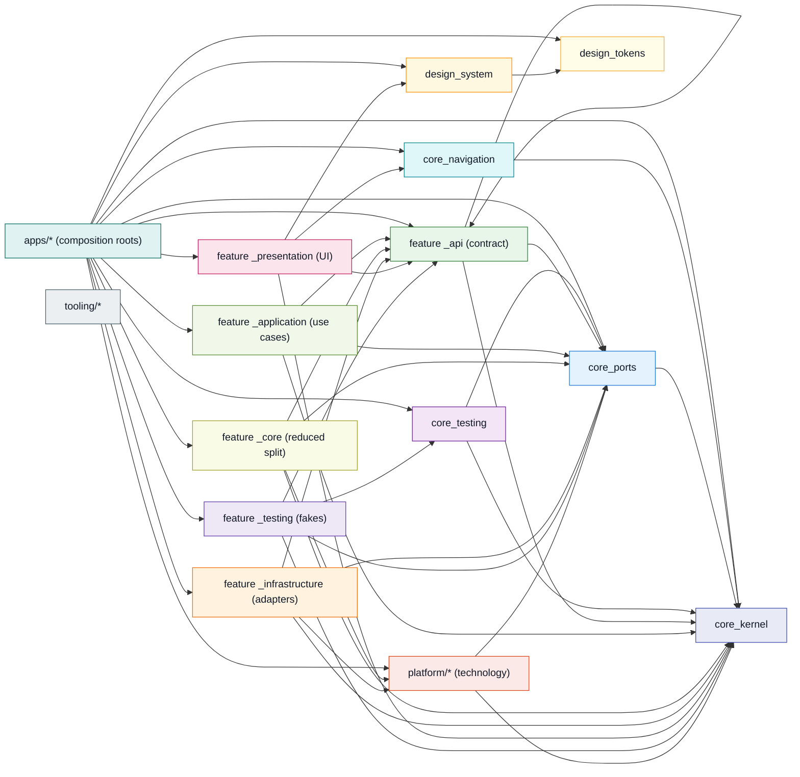
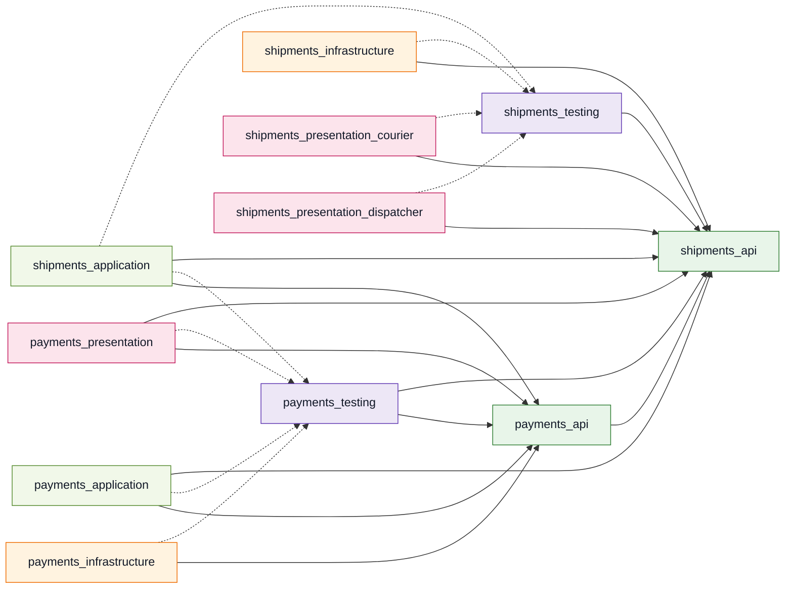
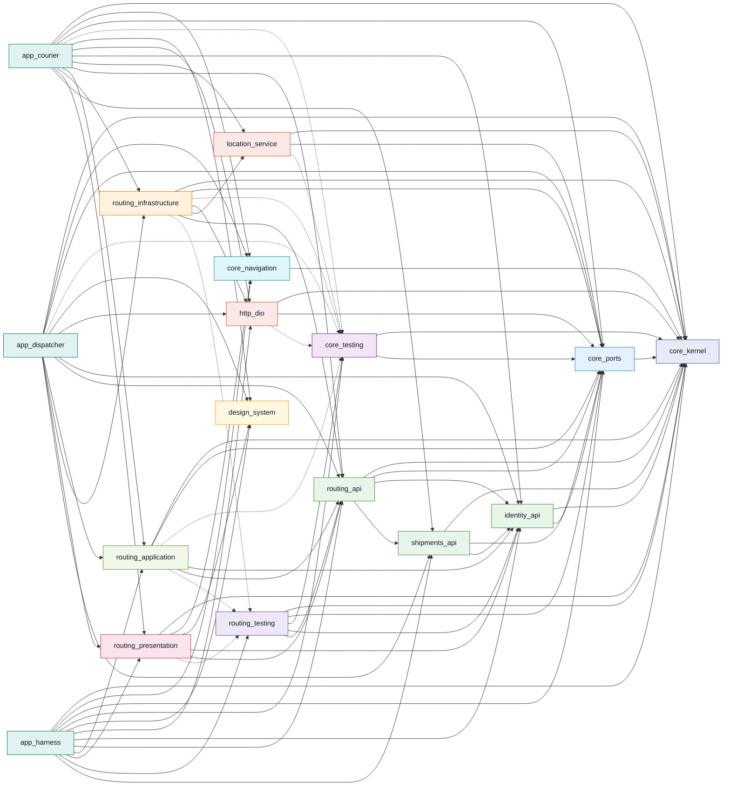

# Dependency graph

<!-- Generated by tooling/dep_graph. Do not hand-edit. -->

```bash
dart run tooling/dep_graph/bin/dep_graph.dart          # rewrite this file
dart run tooling/dep_graph/bin/dep_graph.dart --check  # fail if it is stale
```

Edges are workspace packages only. A third-party dependency is a fact about a
package rather than about the shape of the repository, and drawing seventy of
them would bury the dozen that carry the argument. Dashed edges come from
`dev_dependencies:`, which is how a `_testing` package reaches its consumers
without shipping in anybody's product build.

## Summary

| | |
|---|---|
| Packages | 75 |
| Runtime edges | 415 |
| Dev-dependency edges | 60 |
| Cycles | none |

## Cycles

None. This is success criterion 4 of the specification, and the reason it holds
is the rule in §2 of the dependency rules: when two features need each other,
the answer is mutual `_api` dependencies rather than a `shared` package. A
contract package depends on no implementation, so the edges cannot close a
loop — see the payments/shipments diagram below.

## Legend

| Colour | Type | Packages |
|---|---|---|
| `#e0f2f1` | apps/* (composition roots) | 3 |
| `#e8eaf6` | core_kernel | 1 |
| `#e0f7fa` | core_navigation | 1 |
| `#e3f2fd` | core_ports | 1 |
| `#f3e5f5` | core_testing | 1 |
| `#fff8e1` | design_system | 1 |
| `#fffde7` | design_tokens | 1 |
| `#e8f5e9` | feature _api (contract) | 13 |
| `#f1f8e9` | feature _application (use cases) | 6 |
| `#f9fbe7` | feature _core (reduced split) | 7 |
| `#fff3e0` | feature _infrastructure (adapters) | 6 |
| `#fce4ec` | feature _presentation (UI) | 14 |
| `#ede7f6` | feature _testing (fakes) | 7 |
| `#fbe9e7` | platform/* (technology) | 9 |
| `#eceff1` | tooling/* | 4 |

## The constitution, as it was actually built

One node per package *type*, one edge wherever a package of one type depends on
a package of another. Compare it against the table in §2 of
[`DEPENDENCY_RULES.md`](DEPENDENCY_RULES.md): an edge here that is not in that
table would be a violation `arch_check` fails on, and an edge in the table that
is missing here is a permission nothing has needed yet.



## Scenario 1: two features that need each other, and no cycle

`payments` needs a shipment to attach a collection to; `shipments` needs to
show whether a parcel has been paid for. Neither `_application` package appears
in the other's pubspec — each depends on the other's **contract** only. A
contract package depends on no implementation, so the two arrows cannot close
a loop, and the answer to a mutual need is never a `shared` package.



## One feature in full split, and everything it touches

`routing`, with its five packages and every workspace package they reach.
`routing_application` sees the contract and never an adapter;
`routing_infrastructure` sees the contract and the technology packages;
neither sees the other. The only place they meet is an app.



## Every package

| Package | Type | Depends on (workspace) |
|---|---|---|
| `app_courier` | app | `analytics_otel`, `connectivity_monitor`, `core_kernel`, `core_navigation`, `core_ports`, `delivery_api`, `delivery_application`, `delivery_infrastructure`, `delivery_presentation`, `design_system`, `design_tokens`, `device_permissions`, `documents_api`, `documents_core`, `documents_presentation`, `http_dio`, `identity_api`, `identity_application`, `identity_infrastructure`, `identity_presentation`, `incidents_api`, `incidents_core`, `incidents_presentation`, `location_service`, `media_capture`, `messaging_api`, `messaging_core`, `messaging_presentation`, `notifications_api`, `notifications_core`, `notifications_presentation`, `payments_api`, `payments_application`, `payments_infrastructure`, `payments_presentation`, `push_messaging`, `routing_api`, `routing_application`, `routing_infrastructure`, `routing_presentation`, `secure_store`, `settings_api`, `settings_core`, `settings_presentation`, `shipments_api`, `shipments_application`, `shipments_infrastructure`, `shipments_presentation_courier`, `storage_drift`, `sync_api`, `sync_application`, `sync_infrastructure`, `sync_presentation`, `vehicle_inventory_api`, `vehicle_inventory_core`, `vehicle_inventory_presentation` |
| `app_dispatcher` | app | `analytics_otel`, `connectivity_monitor`, `core_kernel`, `core_navigation`, `core_ports`, `delivery_api`, `delivery_application`, `delivery_infrastructure`, `design_system`, `design_tokens`, `device_permissions`, `http_dio`, `identity_api`, `identity_application`, `identity_infrastructure`, `identity_presentation`, `incidents_api`, `incidents_core`, `incidents_presentation`, `messaging_api`, `messaging_core`, `messaging_presentation`, `notifications_api`, `notifications_core`, `notifications_presentation`, `payments_api`, `payments_application`, `payments_infrastructure`, `payments_presentation`, `reporting_api`, `reporting_core`, `reporting_presentation`, `routing_api`, `routing_application`, `routing_infrastructure`, `routing_presentation`, `secure_store`, `settings_api`, `settings_core`, `settings_presentation`, `shipments_api`, `shipments_application`, `shipments_infrastructure`, `shipments_presentation_dispatcher`, `storage_drift`, `sync_api`, `sync_application`, `sync_infrastructure`, `sync_presentation`, `sync_testing` |
| `app_harness` | app | `core_kernel`, `core_navigation`, `core_ports`, `core_testing`, `delivery_api`, `delivery_application`, `delivery_presentation`, `delivery_testing`, `design_system`, `design_tokens`, `documents_api`, `documents_core`, `documents_presentation`, `http_dio`, `identity_api`, `identity_application`, `identity_presentation`, `identity_testing`, `incidents_api`, `incidents_core`, `incidents_presentation`, `messaging_api`, `messaging_core`, `messaging_presentation`, `messaging_testing`, `notifications_api`, `notifications_core`, `notifications_presentation`, `payments_api`, `payments_application`, `payments_presentation`, `payments_testing`, `push_messaging`, `reporting_api`, `reporting_core`, `reporting_presentation`, `routing_api`, `routing_application`, `routing_presentation`, `routing_testing`, `settings_api`, `settings_core`, `settings_presentation`, `shipments_api`, `shipments_application`, `shipments_presentation_courier`, `shipments_presentation_dispatcher`, `shipments_testing`, `sync_api`, `sync_application`, `sync_presentation`, `sync_testing`, `vehicle_inventory_api`, `vehicle_inventory_core`, `vehicle_inventory_presentation` |
| `core_kernel` | core_kernel | — |
| `core_navigation` | core_navigation | `core_kernel` |
| `core_ports` | core_ports | `core_kernel` |
| `core_testing` | core_testing | `core_kernel`, `core_ports` |
| `design_system` | design_system | `design_tokens` |
| `design_tokens` | design_tokens | — |
| `delivery_api` | feature_api | `core_kernel`, `identity_api`, `shipments_api` |
| `delivery_application` | feature_application | `core_kernel`, `core_ports`, `delivery_api`, `identity_api`, `shipments_api`, `sync_api` |
| `delivery_infrastructure` | feature_infrastructure | `core_kernel`, `core_ports`, `delivery_api`, `http_dio`, `location_service` |
| `delivery_presentation` | feature_presentation | `core_kernel`, `core_navigation`, `delivery_api`, `design_system`, `identity_api`, `shipments_api` |
| `delivery_testing` | feature_testing | `core_kernel`, `core_ports`, `core_testing`, `delivery_api`, `identity_api`, `shipments_api` |
| `documents_api` | feature_api | `core_kernel`, `shipments_api` |
| `documents_core` | feature_core | `core_kernel`, `core_ports`, `documents_api`, `http_dio`, `shipments_api` |
| `documents_presentation` | feature_presentation | `core_kernel`, `core_navigation`, `design_system`, `documents_api`, `shipments_api` |
| `identity_api` | feature_api | `core_kernel`, `core_ports` |
| `identity_application` | feature_application | `core_kernel`, `core_ports`, `identity_api` |
| `identity_infrastructure` | feature_infrastructure | `core_kernel`, `core_ports`, `http_dio`, `identity_api` |
| `identity_presentation` | feature_presentation | `core_kernel`, `core_navigation`, `design_system`, `identity_api` |
| `identity_testing` | feature_testing | `core_kernel`, `core_ports`, `core_testing`, `identity_api` |
| `incidents_api` | feature_api | `core_kernel`, `identity_api`, `shipments_api` |
| `incidents_core` | feature_core | `core_kernel`, `core_ports`, `identity_api`, `incidents_api`, `shipments_api` |
| `incidents_presentation` | feature_presentation | `core_kernel`, `core_navigation`, `design_system`, `identity_api`, `incidents_api`, `shipments_api` |
| `messaging_api` | feature_api | `core_kernel`, `identity_api`, `shipments_api` |
| `messaging_core` | feature_core | `core_kernel`, `core_ports`, `http_dio`, `identity_api`, `messaging_api`, `shipments_api` |
| `messaging_presentation` | feature_presentation | `core_kernel`, `core_navigation`, `design_system`, `identity_api`, `messaging_api`, `shipments_api` |
| `messaging_testing` | feature_testing | `core_kernel`, `core_ports`, `core_testing`, `identity_api`, `messaging_api`, `shipments_api` |
| `notifications_api` | feature_api | `core_kernel`, `identity_api` |
| `notifications_core` | feature_core | `core_kernel`, `core_ports`, `identity_api`, `notifications_api`, `push_messaging` |
| `notifications_presentation` | feature_presentation | `core_kernel`, `core_navigation`, `design_system`, `identity_api`, `notifications_api` |
| `payments_api` | feature_api | `core_kernel`, `identity_api`, `shipments_api` |
| `payments_application` | feature_application | `core_kernel`, `core_ports`, `delivery_api`, `identity_api`, `payments_api`, `shipments_api`, `sync_api` |
| `payments_infrastructure` | feature_infrastructure | `core_kernel`, `core_ports`, `http_dio`, `payments_api` |
| `payments_presentation` | feature_presentation | `core_kernel`, `core_navigation`, `design_system`, `identity_api`, `payments_api`, `shipments_api` |
| `payments_testing` | feature_testing | `core_kernel`, `core_ports`, `core_testing`, `identity_api`, `payments_api`, `shipments_api` |
| `reporting_api` | feature_api | `core_kernel`, `shipments_api` |
| `reporting_core` | feature_core | `core_kernel`, `core_ports`, `reporting_api`, `shipments_api` |
| `reporting_presentation` | feature_presentation | `core_kernel`, `core_navigation`, `design_system`, `identity_api`, `reporting_api` |
| `routing_api` | feature_api | `core_kernel`, `core_ports`, `identity_api`, `shipments_api` |
| `routing_application` | feature_application | `core_kernel`, `core_ports`, `identity_api`, `routing_api` |
| `routing_infrastructure` | feature_infrastructure | `core_kernel`, `core_ports`, `http_dio`, `location_service`, `routing_api` |
| `routing_presentation` | feature_presentation | `core_kernel`, `core_navigation`, `design_system`, `identity_api`, `routing_api` |
| `routing_testing` | feature_testing | `core_kernel`, `core_ports`, `core_testing`, `identity_api`, `routing_api` |
| `settings_api` | feature_api | `core_kernel`, `identity_api` |
| `settings_core` | feature_core | `core_kernel`, `core_ports`, `identity_api`, `settings_api` |
| `settings_presentation` | feature_presentation | `core_kernel`, `core_navigation`, `design_system`, `identity_api`, `settings_api` |
| `shipments_api` | feature_api | `core_kernel`, `core_ports`, `identity_api` |
| `shipments_application` | feature_application | `core_kernel`, `core_ports`, `identity_api`, `payments_api`, `shipments_api` |
| `shipments_infrastructure` | feature_infrastructure | `core_kernel`, `core_ports`, `http_dio`, `shipments_api` |
| `shipments_presentation_courier` | feature_presentation | `core_kernel`, `core_navigation`, `design_system`, `identity_api`, `shipments_api` |
| `shipments_presentation_dispatcher` | feature_presentation | `core_kernel`, `core_navigation`, `design_system`, `identity_api`, `shipments_api` |
| `shipments_testing` | feature_testing | `core_kernel`, `core_ports`, `core_testing`, `identity_api`, `shipments_api` |
| `sync_api` | feature_api | `core_kernel`, `core_ports` |
| `sync_application` | feature_application | `core_kernel`, `core_ports`, `sync_api` |
| `sync_infrastructure` | feature_infrastructure | `core_kernel`, `core_ports`, `http_dio`, `storage_drift`, `sync_api` |
| `sync_presentation` | feature_presentation | `core_kernel`, `core_navigation`, `design_system`, `sync_api` |
| `sync_testing` | feature_testing | `core_kernel`, `core_ports`, `core_testing`, `sync_api` |
| `vehicle_inventory_api` | feature_api | `core_kernel`, `identity_api`, `shipments_api` |
| `vehicle_inventory_core` | feature_core | `core_kernel`, `core_ports`, `http_dio`, `identity_api`, `shipments_api`, `vehicle_inventory_api` |
| `vehicle_inventory_presentation` | feature_presentation | `core_kernel`, `core_navigation`, `design_system`, `identity_api`, `shipments_api`, `vehicle_inventory_api` |
| `analytics_otel` | platform | `core_ports` |
| `connectivity_monitor` | platform | `core_ports` |
| `device_permissions` | platform | `core_kernel`, `core_ports` |
| `http_dio` | platform | `core_kernel`, `core_ports` |
| `location_service` | platform | `core_kernel`, `core_ports` |
| `media_capture` | platform | `core_kernel`, `core_ports` |
| `push_messaging` | platform | `core_kernel`, `core_ports` |
| `secure_store` | platform | `core_kernel`, `core_ports` |
| `storage_drift` | platform | `core_kernel`, `core_ports` |
| `arch_check` | tooling | — |
| `dep_graph` | tooling | — |
| `scaffold` | tooling | — |
| `test_runner` | tooling | — |

## The complete graph, as Graphviz DOT

Mermaid is given three views and DOT is given everything, and the reason is
layout: `dot` ranks a directed acyclic graph so that every edge points the same
way, which turns seventy-odd packages into a picture of the rings. Render it
with `dot -Tsvg`.

```dot
digraph peyk {
  rankdir=LR;
  graph [fontname="Helvetica", splines=true, overlap=false];
  node [shape=box, style="filled,rounded", fontname="Helvetica", fontsize=10];
  edge [color="#90a4ae", arrowsize=0.7];

  subgraph "cluster_apps" {
    label="apps";
    style=dotted;
    color="#b0bec5";
    "app_courier" [fillcolor="#e0f2f1", color="#00695c"];
    "app_dispatcher" [fillcolor="#e0f2f1", color="#00695c"];
    "app_harness" [fillcolor="#e0f2f1", color="#00695c"];
  }

  subgraph "cluster_packages_core" {
    label="packages/core";
    style=dotted;
    color="#b0bec5";
    "core_kernel" [fillcolor="#e8eaf6", color="#3949ab"];
    "core_navigation" [fillcolor="#e0f7fa", color="#00838f"];
    "core_ports" [fillcolor="#e3f2fd", color="#1976d2"];
    "core_testing" [fillcolor="#f3e5f5", color="#6a1b9a"];
  }

  subgraph "cluster_packages_design" {
    label="packages/design";
    style=dotted;
    color="#b0bec5";
    "design_system" [fillcolor="#fff8e1", color="#ff8f00"];
    "design_tokens" [fillcolor="#fffde7", color="#f9a825"];
  }

  subgraph "cluster_packages_features_delivery" {
    label="packages/features/delivery";
    style=dotted;
    color="#b0bec5";
    "delivery_api" [fillcolor="#e8f5e9", color="#2e7d32"];
    "delivery_application" [fillcolor="#f1f8e9", color="#558b2f"];
    "delivery_infrastructure" [fillcolor="#fff3e0", color="#ef6c00"];
    "delivery_presentation" [fillcolor="#fce4ec", color="#c2185b"];
    "delivery_testing" [fillcolor="#ede7f6", color="#5e35b1"];
  }

  subgraph "cluster_packages_features_documents" {
    label="packages/features/documents";
    style=dotted;
    color="#b0bec5";
    "documents_api" [fillcolor="#e8f5e9", color="#2e7d32"];
    "documents_core" [fillcolor="#f9fbe7", color="#9e9d24"];
    "documents_presentation" [fillcolor="#fce4ec", color="#c2185b"];
  }

  subgraph "cluster_packages_features_identity" {
    label="packages/features/identity";
    style=dotted;
    color="#b0bec5";
    "identity_api" [fillcolor="#e8f5e9", color="#2e7d32"];
    "identity_application" [fillcolor="#f1f8e9", color="#558b2f"];
    "identity_infrastructure" [fillcolor="#fff3e0", color="#ef6c00"];
    "identity_presentation" [fillcolor="#fce4ec", color="#c2185b"];
    "identity_testing" [fillcolor="#ede7f6", color="#5e35b1"];
  }

  subgraph "cluster_packages_features_incidents" {
    label="packages/features/incidents";
    style=dotted;
    color="#b0bec5";
    "incidents_api" [fillcolor="#e8f5e9", color="#2e7d32"];
    "incidents_core" [fillcolor="#f9fbe7", color="#9e9d24"];
    "incidents_presentation" [fillcolor="#fce4ec", color="#c2185b"];
  }

  subgraph "cluster_packages_features_messaging" {
    label="packages/features/messaging";
    style=dotted;
    color="#b0bec5";
    "messaging_api" [fillcolor="#e8f5e9", color="#2e7d32"];
    "messaging_core" [fillcolor="#f9fbe7", color="#9e9d24"];
    "messaging_presentation" [fillcolor="#fce4ec", color="#c2185b"];
    "messaging_testing" [fillcolor="#ede7f6", color="#5e35b1"];
  }

  subgraph "cluster_packages_features_notifications" {
    label="packages/features/notifications";
    style=dotted;
    color="#b0bec5";
    "notifications_api" [fillcolor="#e8f5e9", color="#2e7d32"];
    "notifications_core" [fillcolor="#f9fbe7", color="#9e9d24"];
    "notifications_presentation" [fillcolor="#fce4ec", color="#c2185b"];
  }

  subgraph "cluster_packages_features_payments" {
    label="packages/features/payments";
    style=dotted;
    color="#b0bec5";
    "payments_api" [fillcolor="#e8f5e9", color="#2e7d32"];
    "payments_application" [fillcolor="#f1f8e9", color="#558b2f"];
    "payments_infrastructure" [fillcolor="#fff3e0", color="#ef6c00"];
    "payments_presentation" [fillcolor="#fce4ec", color="#c2185b"];
    "payments_testing" [fillcolor="#ede7f6", color="#5e35b1"];
  }

  subgraph "cluster_packages_features_reporting" {
    label="packages/features/reporting";
    style=dotted;
    color="#b0bec5";
    "reporting_api" [fillcolor="#e8f5e9", color="#2e7d32"];
    "reporting_core" [fillcolor="#f9fbe7", color="#9e9d24"];
    "reporting_presentation" [fillcolor="#fce4ec", color="#c2185b"];
  }

  subgraph "cluster_packages_features_routing" {
    label="packages/features/routing";
    style=dotted;
    color="#b0bec5";
    "routing_api" [fillcolor="#e8f5e9", color="#2e7d32"];
    "routing_application" [fillcolor="#f1f8e9", color="#558b2f"];
    "routing_infrastructure" [fillcolor="#fff3e0", color="#ef6c00"];
    "routing_presentation" [fillcolor="#fce4ec", color="#c2185b"];
    "routing_testing" [fillcolor="#ede7f6", color="#5e35b1"];
  }

  subgraph "cluster_packages_features_settings" {
    label="packages/features/settings";
    style=dotted;
    color="#b0bec5";
    "settings_api" [fillcolor="#e8f5e9", color="#2e7d32"];
    "settings_core" [fillcolor="#f9fbe7", color="#9e9d24"];
    "settings_presentation" [fillcolor="#fce4ec", color="#c2185b"];
  }

  subgraph "cluster_packages_features_shipments" {
    label="packages/features/shipments";
    style=dotted;
    color="#b0bec5";
    "shipments_api" [fillcolor="#e8f5e9", color="#2e7d32"];
    "shipments_application" [fillcolor="#f1f8e9", color="#558b2f"];
    "shipments_infrastructure" [fillcolor="#fff3e0", color="#ef6c00"];
    "shipments_presentation_courier" [fillcolor="#fce4ec", color="#c2185b"];
    "shipments_presentation_dispatcher" [fillcolor="#fce4ec", color="#c2185b"];
    "shipments_testing" [fillcolor="#ede7f6", color="#5e35b1"];
  }

  subgraph "cluster_packages_features_sync" {
    label="packages/features/sync";
    style=dotted;
    color="#b0bec5";
    "sync_api" [fillcolor="#e8f5e9", color="#2e7d32"];
    "sync_application" [fillcolor="#f1f8e9", color="#558b2f"];
    "sync_infrastructure" [fillcolor="#fff3e0", color="#ef6c00"];
    "sync_presentation" [fillcolor="#fce4ec", color="#c2185b"];
    "sync_testing" [fillcolor="#ede7f6", color="#5e35b1"];
  }

  subgraph "cluster_packages_features_vehicle_inventory" {
    label="packages/features/vehicle_inventory";
    style=dotted;
    color="#b0bec5";
    "vehicle_inventory_api" [fillcolor="#e8f5e9", color="#2e7d32"];
    "vehicle_inventory_core" [fillcolor="#f9fbe7", color="#9e9d24"];
    "vehicle_inventory_presentation" [fillcolor="#fce4ec", color="#c2185b"];
  }

  subgraph "cluster_packages_platform" {
    label="packages/platform";
    style=dotted;
    color="#b0bec5";
    "analytics_otel" [fillcolor="#fbe9e7", color="#d84315"];
    "connectivity_monitor" [fillcolor="#fbe9e7", color="#d84315"];
    "device_permissions" [fillcolor="#fbe9e7", color="#d84315"];
    "http_dio" [fillcolor="#fbe9e7", color="#d84315"];
    "location_service" [fillcolor="#fbe9e7", color="#d84315"];
    "media_capture" [fillcolor="#fbe9e7", color="#d84315"];
    "push_messaging" [fillcolor="#fbe9e7", color="#d84315"];
    "secure_store" [fillcolor="#fbe9e7", color="#d84315"];
    "storage_drift" [fillcolor="#fbe9e7", color="#d84315"];
  }

  subgraph "cluster_tooling" {
    label="tooling";
    style=dotted;
    color="#b0bec5";
    "arch_check" [fillcolor="#eceff1", color="#455a64"];
    "dep_graph" [fillcolor="#eceff1", color="#455a64"];
    "scaffold" [fillcolor="#eceff1", color="#455a64"];
    "test_runner" [fillcolor="#eceff1", color="#455a64"];
  }

  "analytics_otel" -> "core_ports";
  "app_courier" -> "analytics_otel";
  "app_courier" -> "connectivity_monitor";
  "app_courier" -> "core_kernel";
  "app_courier" -> "core_navigation";
  "app_courier" -> "core_ports";
  "app_courier" -> "delivery_api";
  "app_courier" -> "delivery_application";
  "app_courier" -> "delivery_infrastructure";
  "app_courier" -> "delivery_presentation";
  "app_courier" -> "design_system";
  "app_courier" -> "design_tokens";
  "app_courier" -> "device_permissions";
  "app_courier" -> "documents_api";
  "app_courier" -> "documents_core";
  "app_courier" -> "documents_presentation";
  "app_courier" -> "http_dio";
  "app_courier" -> "identity_api";
  "app_courier" -> "identity_application";
  "app_courier" -> "identity_infrastructure";
  "app_courier" -> "identity_presentation";
  "app_courier" -> "incidents_api";
  "app_courier" -> "incidents_core";
  "app_courier" -> "incidents_presentation";
  "app_courier" -> "location_service";
  "app_courier" -> "media_capture";
  "app_courier" -> "messaging_api";
  "app_courier" -> "messaging_core";
  "app_courier" -> "messaging_presentation";
  "app_courier" -> "notifications_api";
  "app_courier" -> "notifications_core";
  "app_courier" -> "notifications_presentation";
  "app_courier" -> "payments_api";
  "app_courier" -> "payments_application";
  "app_courier" -> "payments_infrastructure";
  "app_courier" -> "payments_presentation";
  "app_courier" -> "push_messaging";
  "app_courier" -> "routing_api";
  "app_courier" -> "routing_application";
  "app_courier" -> "routing_infrastructure";
  "app_courier" -> "routing_presentation";
  "app_courier" -> "secure_store";
  "app_courier" -> "settings_api";
  "app_courier" -> "settings_core";
  "app_courier" -> "settings_presentation";
  "app_courier" -> "shipments_api";
  "app_courier" -> "shipments_application";
  "app_courier" -> "shipments_infrastructure";
  "app_courier" -> "shipments_presentation_courier";
  "app_courier" -> "storage_drift";
  "app_courier" -> "sync_api";
  "app_courier" -> "sync_application";
  "app_courier" -> "sync_infrastructure";
  "app_courier" -> "sync_presentation";
  "app_courier" -> "vehicle_inventory_api";
  "app_courier" -> "vehicle_inventory_core";
  "app_courier" -> "vehicle_inventory_presentation";
  "app_dispatcher" -> "analytics_otel";
  "app_dispatcher" -> "connectivity_monitor";
  "app_dispatcher" -> "core_kernel";
  "app_dispatcher" -> "core_navigation";
  "app_dispatcher" -> "core_ports";
  "app_dispatcher" -> "delivery_api";
  "app_dispatcher" -> "delivery_application";
  "app_dispatcher" -> "delivery_infrastructure";
  "app_dispatcher" -> "design_system";
  "app_dispatcher" -> "design_tokens";
  "app_dispatcher" -> "device_permissions";
  "app_dispatcher" -> "http_dio";
  "app_dispatcher" -> "identity_api";
  "app_dispatcher" -> "identity_application";
  "app_dispatcher" -> "identity_infrastructure";
  "app_dispatcher" -> "identity_presentation";
  "app_dispatcher" -> "incidents_api";
  "app_dispatcher" -> "incidents_core";
  "app_dispatcher" -> "incidents_presentation";
  "app_dispatcher" -> "messaging_api";
  "app_dispatcher" -> "messaging_core";
  "app_dispatcher" -> "messaging_presentation";
  "app_dispatcher" -> "notifications_api";
  "app_dispatcher" -> "notifications_core";
  "app_dispatcher" -> "notifications_presentation";
  "app_dispatcher" -> "payments_api";
  "app_dispatcher" -> "payments_application";
  "app_dispatcher" -> "payments_infrastructure";
  "app_dispatcher" -> "payments_presentation";
  "app_dispatcher" -> "reporting_api";
  "app_dispatcher" -> "reporting_core";
  "app_dispatcher" -> "reporting_presentation";
  "app_dispatcher" -> "routing_api";
  "app_dispatcher" -> "routing_application";
  "app_dispatcher" -> "routing_infrastructure";
  "app_dispatcher" -> "routing_presentation";
  "app_dispatcher" -> "secure_store";
  "app_dispatcher" -> "settings_api";
  "app_dispatcher" -> "settings_core";
  "app_dispatcher" -> "settings_presentation";
  "app_dispatcher" -> "shipments_api";
  "app_dispatcher" -> "shipments_application";
  "app_dispatcher" -> "shipments_infrastructure";
  "app_dispatcher" -> "shipments_presentation_dispatcher";
  "app_dispatcher" -> "storage_drift";
  "app_dispatcher" -> "sync_api";
  "app_dispatcher" -> "sync_application";
  "app_dispatcher" -> "sync_infrastructure";
  "app_dispatcher" -> "sync_presentation";
  "app_dispatcher" -> "sync_testing";
  "app_harness" -> "core_kernel";
  "app_harness" -> "core_navigation";
  "app_harness" -> "core_ports";
  "app_harness" -> "core_testing";
  "app_harness" -> "delivery_api";
  "app_harness" -> "delivery_application";
  "app_harness" -> "delivery_presentation";
  "app_harness" -> "delivery_testing";
  "app_harness" -> "design_system";
  "app_harness" -> "design_tokens";
  "app_harness" -> "documents_api";
  "app_harness" -> "documents_core";
  "app_harness" -> "documents_presentation";
  "app_harness" -> "http_dio";
  "app_harness" -> "identity_api";
  "app_harness" -> "identity_application";
  "app_harness" -> "identity_presentation";
  "app_harness" -> "identity_testing";
  "app_harness" -> "incidents_api";
  "app_harness" -> "incidents_core";
  "app_harness" -> "incidents_presentation";
  "app_harness" -> "messaging_api";
  "app_harness" -> "messaging_core";
  "app_harness" -> "messaging_presentation";
  "app_harness" -> "messaging_testing";
  "app_harness" -> "notifications_api";
  "app_harness" -> "notifications_core";
  "app_harness" -> "notifications_presentation";
  "app_harness" -> "payments_api";
  "app_harness" -> "payments_application";
  "app_harness" -> "payments_presentation";
  "app_harness" -> "payments_testing";
  "app_harness" -> "push_messaging";
  "app_harness" -> "reporting_api";
  "app_harness" -> "reporting_core";
  "app_harness" -> "reporting_presentation";
  "app_harness" -> "routing_api";
  "app_harness" -> "routing_application";
  "app_harness" -> "routing_presentation";
  "app_harness" -> "routing_testing";
  "app_harness" -> "settings_api";
  "app_harness" -> "settings_core";
  "app_harness" -> "settings_presentation";
  "app_harness" -> "shipments_api";
  "app_harness" -> "shipments_application";
  "app_harness" -> "shipments_presentation_courier";
  "app_harness" -> "shipments_presentation_dispatcher";
  "app_harness" -> "shipments_testing";
  "app_harness" -> "sync_api";
  "app_harness" -> "sync_application";
  "app_harness" -> "sync_presentation";
  "app_harness" -> "sync_testing";
  "app_harness" -> "vehicle_inventory_api";
  "app_harness" -> "vehicle_inventory_core";
  "app_harness" -> "vehicle_inventory_presentation";
  "connectivity_monitor" -> "core_ports";
  "core_navigation" -> "core_kernel";
  "core_ports" -> "core_kernel";
  "core_testing" -> "core_kernel";
  "core_testing" -> "core_ports";
  "delivery_api" -> "core_kernel";
  "delivery_api" -> "identity_api";
  "delivery_api" -> "shipments_api";
  "delivery_application" -> "core_kernel";
  "delivery_application" -> "core_ports";
  "delivery_application" -> "delivery_api";
  "delivery_application" -> "identity_api";
  "delivery_application" -> "shipments_api";
  "delivery_application" -> "sync_api";
  "delivery_infrastructure" -> "core_kernel";
  "delivery_infrastructure" -> "core_ports";
  "delivery_infrastructure" -> "delivery_api";
  "delivery_infrastructure" -> "http_dio";
  "delivery_infrastructure" -> "location_service";
  "delivery_presentation" -> "core_kernel";
  "delivery_presentation" -> "core_navigation";
  "delivery_presentation" -> "delivery_api";
  "delivery_presentation" -> "design_system";
  "delivery_presentation" -> "identity_api";
  "delivery_presentation" -> "shipments_api";
  "delivery_testing" -> "core_kernel";
  "delivery_testing" -> "core_ports";
  "delivery_testing" -> "core_testing";
  "delivery_testing" -> "delivery_api";
  "delivery_testing" -> "identity_api";
  "delivery_testing" -> "shipments_api";
  "design_system" -> "design_tokens";
  "device_permissions" -> "core_kernel";
  "device_permissions" -> "core_ports";
  "documents_api" -> "core_kernel";
  "documents_api" -> "shipments_api";
  "documents_core" -> "core_kernel";
  "documents_core" -> "core_ports";
  "documents_core" -> "documents_api";
  "documents_core" -> "http_dio";
  "documents_core" -> "shipments_api";
  "documents_presentation" -> "core_kernel";
  "documents_presentation" -> "core_navigation";
  "documents_presentation" -> "design_system";
  "documents_presentation" -> "documents_api";
  "documents_presentation" -> "shipments_api";
  "http_dio" -> "core_kernel";
  "http_dio" -> "core_ports";
  "identity_api" -> "core_kernel";
  "identity_api" -> "core_ports";
  "identity_application" -> "core_kernel";
  "identity_application" -> "core_ports";
  "identity_application" -> "identity_api";
  "identity_infrastructure" -> "core_kernel";
  "identity_infrastructure" -> "core_ports";
  "identity_infrastructure" -> "http_dio";
  "identity_infrastructure" -> "identity_api";
  "identity_presentation" -> "core_kernel";
  "identity_presentation" -> "core_navigation";
  "identity_presentation" -> "design_system";
  "identity_presentation" -> "identity_api";
  "identity_testing" -> "core_kernel";
  "identity_testing" -> "core_ports";
  "identity_testing" -> "core_testing";
  "identity_testing" -> "identity_api";
  "incidents_api" -> "core_kernel";
  "incidents_api" -> "identity_api";
  "incidents_api" -> "shipments_api";
  "incidents_core" -> "core_kernel";
  "incidents_core" -> "core_ports";
  "incidents_core" -> "identity_api";
  "incidents_core" -> "incidents_api";
  "incidents_core" -> "shipments_api";
  "incidents_presentation" -> "core_kernel";
  "incidents_presentation" -> "core_navigation";
  "incidents_presentation" -> "design_system";
  "incidents_presentation" -> "identity_api";
  "incidents_presentation" -> "incidents_api";
  "incidents_presentation" -> "shipments_api";
  "location_service" -> "core_kernel";
  "location_service" -> "core_ports";
  "media_capture" -> "core_kernel";
  "media_capture" -> "core_ports";
  "messaging_api" -> "core_kernel";
  "messaging_api" -> "identity_api";
  "messaging_api" -> "shipments_api";
  "messaging_core" -> "core_kernel";
  "messaging_core" -> "core_ports";
  "messaging_core" -> "http_dio";
  "messaging_core" -> "identity_api";
  "messaging_core" -> "messaging_api";
  "messaging_core" -> "shipments_api";
  "messaging_presentation" -> "core_kernel";
  "messaging_presentation" -> "core_navigation";
  "messaging_presentation" -> "design_system";
  "messaging_presentation" -> "identity_api";
  "messaging_presentation" -> "messaging_api";
  "messaging_presentation" -> "shipments_api";
  "messaging_testing" -> "core_kernel";
  "messaging_testing" -> "core_ports";
  "messaging_testing" -> "core_testing";
  "messaging_testing" -> "identity_api";
  "messaging_testing" -> "messaging_api";
  "messaging_testing" -> "shipments_api";
  "notifications_api" -> "core_kernel";
  "notifications_api" -> "identity_api";
  "notifications_core" -> "core_kernel";
  "notifications_core" -> "core_ports";
  "notifications_core" -> "identity_api";
  "notifications_core" -> "notifications_api";
  "notifications_core" -> "push_messaging";
  "notifications_presentation" -> "core_kernel";
  "notifications_presentation" -> "core_navigation";
  "notifications_presentation" -> "design_system";
  "notifications_presentation" -> "identity_api";
  "notifications_presentation" -> "notifications_api";
  "payments_api" -> "core_kernel";
  "payments_api" -> "identity_api";
  "payments_api" -> "shipments_api";
  "payments_application" -> "core_kernel";
  "payments_application" -> "core_ports";
  "payments_application" -> "delivery_api";
  "payments_application" -> "identity_api";
  "payments_application" -> "payments_api";
  "payments_application" -> "shipments_api";
  "payments_application" -> "sync_api";
  "payments_infrastructure" -> "core_kernel";
  "payments_infrastructure" -> "core_ports";
  "payments_infrastructure" -> "http_dio";
  "payments_infrastructure" -> "payments_api";
  "payments_presentation" -> "core_kernel";
  "payments_presentation" -> "core_navigation";
  "payments_presentation" -> "design_system";
  "payments_presentation" -> "identity_api";
  "payments_presentation" -> "payments_api";
  "payments_presentation" -> "shipments_api";
  "payments_testing" -> "core_kernel";
  "payments_testing" -> "core_ports";
  "payments_testing" -> "core_testing";
  "payments_testing" -> "identity_api";
  "payments_testing" -> "payments_api";
  "payments_testing" -> "shipments_api";
  "push_messaging" -> "core_kernel";
  "push_messaging" -> "core_ports";
  "reporting_api" -> "core_kernel";
  "reporting_api" -> "shipments_api";
  "reporting_core" -> "core_kernel";
  "reporting_core" -> "core_ports";
  "reporting_core" -> "reporting_api";
  "reporting_core" -> "shipments_api";
  "reporting_presentation" -> "core_kernel";
  "reporting_presentation" -> "core_navigation";
  "reporting_presentation" -> "design_system";
  "reporting_presentation" -> "identity_api";
  "reporting_presentation" -> "reporting_api";
  "routing_api" -> "core_kernel";
  "routing_api" -> "core_ports";
  "routing_api" -> "identity_api";
  "routing_api" -> "shipments_api";
  "routing_application" -> "core_kernel";
  "routing_application" -> "core_ports";
  "routing_application" -> "identity_api";
  "routing_application" -> "routing_api";
  "routing_infrastructure" -> "core_kernel";
  "routing_infrastructure" -> "core_ports";
  "routing_infrastructure" -> "http_dio";
  "routing_infrastructure" -> "location_service";
  "routing_infrastructure" -> "routing_api";
  "routing_presentation" -> "core_kernel";
  "routing_presentation" -> "core_navigation";
  "routing_presentation" -> "design_system";
  "routing_presentation" -> "identity_api";
  "routing_presentation" -> "routing_api";
  "routing_testing" -> "core_kernel";
  "routing_testing" -> "core_ports";
  "routing_testing" -> "core_testing";
  "routing_testing" -> "identity_api";
  "routing_testing" -> "routing_api";
  "secure_store" -> "core_kernel";
  "secure_store" -> "core_ports";
  "settings_api" -> "core_kernel";
  "settings_api" -> "identity_api";
  "settings_core" -> "core_kernel";
  "settings_core" -> "core_ports";
  "settings_core" -> "identity_api";
  "settings_core" -> "settings_api";
  "settings_presentation" -> "core_kernel";
  "settings_presentation" -> "core_navigation";
  "settings_presentation" -> "design_system";
  "settings_presentation" -> "identity_api";
  "settings_presentation" -> "settings_api";
  "shipments_api" -> "core_kernel";
  "shipments_api" -> "core_ports";
  "shipments_api" -> "identity_api";
  "shipments_application" -> "core_kernel";
  "shipments_application" -> "core_ports";
  "shipments_application" -> "identity_api";
  "shipments_application" -> "payments_api";
  "shipments_application" -> "shipments_api";
  "shipments_infrastructure" -> "core_kernel";
  "shipments_infrastructure" -> "core_ports";
  "shipments_infrastructure" -> "http_dio";
  "shipments_infrastructure" -> "shipments_api";
  "shipments_presentation_courier" -> "core_kernel";
  "shipments_presentation_courier" -> "core_navigation";
  "shipments_presentation_courier" -> "design_system";
  "shipments_presentation_courier" -> "identity_api";
  "shipments_presentation_courier" -> "shipments_api";
  "shipments_presentation_dispatcher" -> "core_kernel";
  "shipments_presentation_dispatcher" -> "core_navigation";
  "shipments_presentation_dispatcher" -> "design_system";
  "shipments_presentation_dispatcher" -> "identity_api";
  "shipments_presentation_dispatcher" -> "shipments_api";
  "shipments_testing" -> "core_kernel";
  "shipments_testing" -> "core_ports";
  "shipments_testing" -> "core_testing";
  "shipments_testing" -> "identity_api";
  "shipments_testing" -> "shipments_api";
  "storage_drift" -> "core_kernel";
  "storage_drift" -> "core_ports";
  "sync_api" -> "core_kernel";
  "sync_api" -> "core_ports";
  "sync_application" -> "core_kernel";
  "sync_application" -> "core_ports";
  "sync_application" -> "sync_api";
  "sync_infrastructure" -> "core_kernel";
  "sync_infrastructure" -> "core_ports";
  "sync_infrastructure" -> "http_dio";
  "sync_infrastructure" -> "storage_drift";
  "sync_infrastructure" -> "sync_api";
  "sync_presentation" -> "core_kernel";
  "sync_presentation" -> "core_navigation";
  "sync_presentation" -> "design_system";
  "sync_presentation" -> "sync_api";
  "sync_testing" -> "core_kernel";
  "sync_testing" -> "core_ports";
  "sync_testing" -> "core_testing";
  "sync_testing" -> "sync_api";
  "vehicle_inventory_api" -> "core_kernel";
  "vehicle_inventory_api" -> "identity_api";
  "vehicle_inventory_api" -> "shipments_api";
  "vehicle_inventory_core" -> "core_kernel";
  "vehicle_inventory_core" -> "core_ports";
  "vehicle_inventory_core" -> "http_dio";
  "vehicle_inventory_core" -> "identity_api";
  "vehicle_inventory_core" -> "shipments_api";
  "vehicle_inventory_core" -> "vehicle_inventory_api";
  "vehicle_inventory_presentation" -> "core_kernel";
  "vehicle_inventory_presentation" -> "core_navigation";
  "vehicle_inventory_presentation" -> "design_system";
  "vehicle_inventory_presentation" -> "identity_api";
  "vehicle_inventory_presentation" -> "shipments_api";
  "vehicle_inventory_presentation" -> "vehicle_inventory_api";
  "analytics_otel" -> "core_testing" [style=dashed, color="#cfd8dc"];
  "app_courier" -> "core_testing" [style=dashed, color="#cfd8dc"];
  "app_courier" -> "delivery_testing" [style=dashed, color="#cfd8dc"];
  "app_courier" -> "identity_testing" [style=dashed, color="#cfd8dc"];
  "app_dispatcher" -> "core_testing" [style=dashed, color="#cfd8dc"];
  "app_dispatcher" -> "identity_testing" [style=dashed, color="#cfd8dc"];
  "delivery_application" -> "core_testing" [style=dashed, color="#cfd8dc"];
  "delivery_application" -> "delivery_testing" [style=dashed, color="#cfd8dc"];
  "delivery_application" -> "sync_testing" [style=dashed, color="#cfd8dc"];
  "delivery_infrastructure" -> "core_testing" [style=dashed, color="#cfd8dc"];
  "delivery_infrastructure" -> "delivery_testing" [style=dashed, color="#cfd8dc"];
  "delivery_presentation" -> "delivery_testing" [style=dashed, color="#cfd8dc"];
  "delivery_presentation" -> "identity_testing" [style=dashed, color="#cfd8dc"];
  "device_permissions" -> "core_testing" [style=dashed, color="#cfd8dc"];
  "documents_core" -> "core_testing" [style=dashed, color="#cfd8dc"];
  "http_dio" -> "core_testing" [style=dashed, color="#cfd8dc"];
  "identity_application" -> "core_testing" [style=dashed, color="#cfd8dc"];
  "identity_application" -> "identity_testing" [style=dashed, color="#cfd8dc"];
  "identity_infrastructure" -> "core_testing" [style=dashed, color="#cfd8dc"];
  "identity_infrastructure" -> "identity_testing" [style=dashed, color="#cfd8dc"];
  "identity_presentation" -> "identity_testing" [style=dashed, color="#cfd8dc"];
  "incidents_core" -> "core_testing" [style=dashed, color="#cfd8dc"];
  "location_service" -> "core_testing" [style=dashed, color="#cfd8dc"];
  "media_capture" -> "core_testing" [style=dashed, color="#cfd8dc"];
  "messaging_core" -> "core_testing" [style=dashed, color="#cfd8dc"];
  "messaging_core" -> "messaging_testing" [style=dashed, color="#cfd8dc"];
  "messaging_presentation" -> "messaging_testing" [style=dashed, color="#cfd8dc"];
  "notifications_core" -> "core_testing" [style=dashed, color="#cfd8dc"];
  "payments_application" -> "core_testing" [style=dashed, color="#cfd8dc"];
  "payments_application" -> "payments_testing" [style=dashed, color="#cfd8dc"];
  "payments_application" -> "sync_testing" [style=dashed, color="#cfd8dc"];
  "payments_infrastructure" -> "core_testing" [style=dashed, color="#cfd8dc"];
  "payments_infrastructure" -> "payments_testing" [style=dashed, color="#cfd8dc"];
  "payments_presentation" -> "identity_testing" [style=dashed, color="#cfd8dc"];
  "payments_presentation" -> "payments_testing" [style=dashed, color="#cfd8dc"];
  "push_messaging" -> "core_testing" [style=dashed, color="#cfd8dc"];
  "reporting_core" -> "core_testing" [style=dashed, color="#cfd8dc"];
  "reporting_presentation" -> "shipments_api" [style=dashed, color="#cfd8dc"];
  "routing_application" -> "core_testing" [style=dashed, color="#cfd8dc"];
  "routing_application" -> "routing_testing" [style=dashed, color="#cfd8dc"];
  "routing_infrastructure" -> "core_testing" [style=dashed, color="#cfd8dc"];
  "routing_infrastructure" -> "routing_testing" [style=dashed, color="#cfd8dc"];
  "routing_presentation" -> "routing_testing" [style=dashed, color="#cfd8dc"];
  "settings_core" -> "core_testing" [style=dashed, color="#cfd8dc"];
  "shipments_application" -> "core_testing" [style=dashed, color="#cfd8dc"];
  "shipments_application" -> "payments_testing" [style=dashed, color="#cfd8dc"];
  "shipments_application" -> "shipments_testing" [style=dashed, color="#cfd8dc"];
  "shipments_infrastructure" -> "core_testing" [style=dashed, color="#cfd8dc"];
  "shipments_infrastructure" -> "shipments_testing" [style=dashed, color="#cfd8dc"];
  "shipments_presentation_courier" -> "identity_testing" [style=dashed, color="#cfd8dc"];
  "shipments_presentation_courier" -> "shipments_testing" [style=dashed, color="#cfd8dc"];
  "shipments_presentation_dispatcher" -> "identity_testing" [style=dashed, color="#cfd8dc"];
  "shipments_presentation_dispatcher" -> "shipments_testing" [style=dashed, color="#cfd8dc"];
  "storage_drift" -> "core_testing" [style=dashed, color="#cfd8dc"];
  "sync_application" -> "core_testing" [style=dashed, color="#cfd8dc"];
  "sync_application" -> "sync_testing" [style=dashed, color="#cfd8dc"];
  "sync_infrastructure" -> "core_testing" [style=dashed, color="#cfd8dc"];
  "sync_infrastructure" -> "sync_testing" [style=dashed, color="#cfd8dc"];
  "sync_presentation" -> "sync_testing" [style=dashed, color="#cfd8dc"];
  "vehicle_inventory_core" -> "core_testing" [style=dashed, color="#cfd8dc"];
}
```
